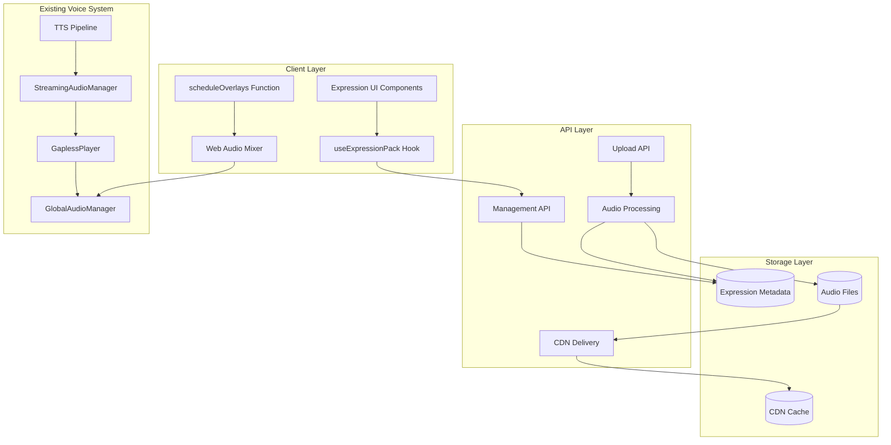

# Design Document

## Overview

The Authentic Expressions Pipeline is designed as a modular, performance-first system that seamlessly integrates authentic recorded expressions into the existing voice experience. The system leverages the current audio architecture (GlobalAudioManager, GaplessPlayer, StreamingAudioManager) while adding a new overlay layer that operates independently of TTS generation.

The design follows a three-tier architecture:
1. **Storage & API Layer** - Handles expression upload, processing, and delivery
2. **Client Runtime Layer** - Manages expression playback and audio mixing
3. **UI Management Layer** - Provides user and admin interfaces for expression management

Key design principles:
- **Non-blocking TTS**: Expressions never delay TTS start time
- **Graceful degradation**: System works perfectly without expressions
- **Modular integration**: Minimal changes to existing voice pipeline
- **Performance-first**: Optimized for mobile and low-bandwidth scenarios

## Architecture

### System Components



### Data Flow

1. **Expression Upload Flow**:
   - User records/uploads → Processing (normalize, trim, fade) → Storage (DB + Bucket) → CDN
   
2. **Runtime Playback Flow**:
   - Text analysis → Expression selection → Buffer preload → Overlay scheduling → Audio mixing

3. **Admin Management Flow**:
   - Bulk upload → Manifest processing → Avatar assignment → Version control

## Components and Interfaces

### Database Schema (MVP)

```sql
-- Single expression clips table (simplified)
CREATE TABLE expression_clips (
    id UUID PRIMARY KEY DEFAULT gen_random_uuid(),
    owner_type VARCHAR(20) NOT NULL, -- 'user' or 'avatar'
    owner_key VARCHAR(255) NOT NULL, -- user_id or avatar_id
    filename VARCHAR(255) NOT NULL,
    type expression_type NOT NULL,
    tone VARCHAR(50),
    placement_hints TEXT[],
    duration_ms INTEGER NOT NULL,
    cdn_url TEXT NOT NULL,
    priority INTEGER DEFAULT 0,
    status expression_status DEFAULT 'active',
    created_at TIMESTAMP WITH TIME ZONE DEFAULT NOW()
);

-- Enum types
CREATE TYPE expression_type AS ENUM (
    'laugh', 'sigh', 'breath', 'affirmation', 
    'greeting', 'catchphrase', 'filler'
);

CREATE TYPE expression_status AS ENUM (
    'active', 'inactive', 'processing', 'failed'
);

-- Index for fast lookups
CREATE INDEX idx_expression_clips_owner ON expression_clips(owner_type, owner_key, status);
```

### API Interfaces

```typescript
// Upload API
interface ExpressionUploadRequest {
  file: File;
  type: ExpressionType;
  tone?: string;
  placementHints?: string[];
  avatarId?: string; // For admin uploads
}

interface ExpressionUploadResponse {
  id: string;
  cdnUrl: string;
  durationMs: number;
  status: 'processing' | 'active';
}

// Management API
interface ExpressionListRequest {
  ownerId?: string;
  avatarId?: string;
  type?: ExpressionType;
  status?: ExpressionStatus;
  limit?: number;
  offset?: number;
}

interface ExpressionUpdateRequest {
  status?: ExpressionStatus;
  priority?: number;
  tone?: string;
  placementHints?: string[];
}

// Bulk Admin API
interface BulkUploadRequest {
  zipFile: File;
  avatarId: string;
  packName: string;
  version: string;
}

interface ManifestEntry {
  filename: string;
  type: ExpressionType;
  tone?: string;
  placementHints?: string[];
  priority?: number;
}
```

### Client Runtime Interfaces

```typescript
// Expression Pack Hook
interface ExpressionPack {
  clips: ExpressionClip[];
  preloadedBuffers: Map<string, AudioBuffer>;
  isLoaded: boolean;
}

interface ExpressionClip {
  id: string;
  type: ExpressionType;
  tone?: string;
  placementHints?: string[];
  cdnUrl: string;
  durationMs: number;
  priority: number;
}

// Overlay Scheduler
interface OverlaySchedule {
  clip: ExpressionClip;
  startTimeMs: number;
  duckingLevel: number; // 0-1, amount to reduce TTS volume
}

interface ScheduleOverlaysOptions {
  maxOverlays?: number; // Default: 3
  minSpacingMs?: number; // Default: 3000
  duckingAmount?: number; // Default: 0.3 (3-6dB reduction)
}
```

## Data Models

### Expression Processing Pipeline (MVP)

```typescript
class ExpressionProcessor {
  async processUpload(file: File, metadata: ExpressionMetadata): Promise<ProcessedExpression> {
    // 1. Validate file format and size (max 5MB, common audio formats)
    const validation = await this.validateFile(file);
    if (!validation.valid) throw new Error(validation.error);
    
    // 2. Load audio buffer
    const audioBuffer = await this.loadAudioBuffer(file);
    
    // 3. Basic trim silences (simple threshold-based)
    const trimmed = await this.trimSilences(audioBuffer, 0.01);
    
    // 4. Apply fade in/out (prevent clicks)
    const faded = await this.applyFades(trimmed, 15, 20); // 15ms in, 20ms out
    
    // 5. Encode to mp3 22.05kHz mono
    const encoded = await this.encodeToMp3(faded, {
      sampleRate: 22050,
      channels: 1,
      bitrate: 64
    });
    
    // 6. Calculate duration
    const durationMs = Math.round((trimmed.length / trimmed.sampleRate) * 1000);
    
    return {
      audioData: encoded,
      durationMs,
      fileSize: encoded.byteLength
    };
  }
}
```

### Expression Selection Engine (MVP)

```typescript
class ExpressionSelector {
  selectExpressions(
    text: string, 
    clips: ExpressionClip[], 
    options: ScheduleOverlaysOptions = {}
  ): OverlaySchedule[] {
    const maxOverlays = options.maxOverlays || 2;
    const minSpacingMs = options.minSpacingMs || 4000;
    
    // Simple text-based matching (no NLP)
    const candidates = this.findSimpleCandidates(text, clips);
    const selected = this.prioritizeAndLimit(candidates, maxOverlays);
    return this.scheduleWithSpacing(selected, text, minSpacingMs);
  }
  
  private findSimpleCandidates(text: string, clips: ExpressionClip[]): ExpressionClip[] {
    const lowerText = text.toLowerCase();
    
    return clips.filter(clip => {
      // Simple keyword/pattern matching
      switch (clip.type) {
        case 'laugh':
          return /\b(funny|hilarious|laugh|haha|lol)\b/.test(lowerText);
        case 'sigh':
          return /\b(unfortunately|sadly|sigh|oh well)\b/.test(lowerText);
        case 'breath':
          return text.length > 100; // Long responses get breathing room
        case 'affirmation':
          return /\b(exactly|absolutely|definitely|yes)\b/.test(lowerText);
        case 'greeting':
          return /\b(hello|hi|hey|welcome)\b/.test(lowerText);
        default:
          return Math.random() < 0.1; // 10% chance for catchphrases/fillers
      }
    });
  }
  
  private scheduleWithSpacing(clips: ExpressionClip[], text: string, minSpacingMs: number): OverlaySchedule[] {
    if (clips.length === 0) return [];
    
    const estimatedDurationMs = text.length * 50; // ~50ms per character rough estimate
    const schedules: OverlaySchedule[] = [];
    
    clips.forEach((clip, index) => {
      const startTime = (estimatedDurationMs / (clips.length + 1)) * (index + 1);
      schedules.push({
        clip,
        startTimeMs: Math.max(startTime, index * minSpacingMs),
        duckingLevel: 0.4 // 3-6dB reduction
      });
    });
    
    return schedules;
  }
}
```

## Error Handling

### Graceful Degradation Strategy

```typescript
class ExpressionErrorHandler {
  async handleExpressionFailure(error: ExpressionError, context: PlaybackContext): Promise<void> {
    // Log error for monitoring
    this.logger.warn('Expression playback failed', { error, context });
    
    // Update metrics
    this.metrics.increment('expression_failures', {
      type: error.type,
      stage: error.stage
    });
    
    // Graceful fallback - continue TTS without expressions
    switch (error.type) {
      case 'NETWORK_ERROR':
        // Skip expressions for this turn, retry next turn
        context.skipExpressions = true;
        break;
        
      case 'BUFFER_NOT_READY':
        // Continue without this specific expression
        context.removeExpression(error.expressionId);
        break;
        
      case 'AUDIO_CONTEXT_ERROR':
        // Disable expressions for session
        context.disableExpressions();
        break;
        
      default:
        // Unknown error - disable expressions temporarily
        context.temporaryDisable(30000); // 30 seconds
    }
  }
}
```

### Network Resilience

```typescript
class ExpressionNetworkManager {
  async preloadWithRetry(url: string, maxRetries: number = 3): Promise<AudioBuffer | null> {
    for (let attempt = 1; attempt <= maxRetries; attempt++) {
      try {
        const response = await fetch(url, {
          cache: 'force-cache', // Prefer cached version
          priority: 'low' // Don't compete with TTS requests
        });
        
        if (!response.ok) throw new Error(`HTTP ${response.status}`);
        
        const arrayBuffer = await response.arrayBuffer();
        return await this.audioContext.decodeAudioData(arrayBuffer);
        
      } catch (error) {
        if (attempt === maxRetries) {
          this.logger.warn('Expression preload failed after retries', { url, error });
          return null;
        }
        
        // Exponential backoff
        await this.delay(Math.pow(2, attempt) * 100);
      }
    }
    return null;
  }
}
```

## Testing Strategy

### Unit Tests

```typescript
describe('ExpressionProcessor', () => {
  it('should normalize audio loudness to -23 LUFS', async () => {
    const processor = new ExpressionProcessor();
    const testAudio = generateTestAudio({ loudness: -10 }); // Too loud
    
    const result = await processor.processUpload(testAudio, mockMetadata);
    
    expect(result.metadata.loudnessLUFS).toBeCloseTo(-23, 1);
  });
  
  it('should trim silence from beginning and end', async () => {
    const processor = new ExpressionProcessor();
    const testAudio = generateTestAudioWithSilence(1000, 500); // 1s start, 0.5s end silence
    
    const result = await processor.processUpload(testAudio, mockMetadata);
    
    expect(result.durationMs).toBeLessThan(testAudio.originalDurationMs - 1400);
  });
});

describe('ExpressionSelector', () => {
  it('should select appropriate expressions for text context', () => {
    const selector = new ExpressionSelector();
    const laughText = "That's hilarious! I can't stop laughing.";
    const pack = createMockExpressionPack();
    
    const selections = selector.selectExpressions(laughText, pack, {});
    
    expect(selections.some(s => s.clip.type === 'laugh')).toBe(true);
  });
  
  it('should respect overlay limits and spacing', () => {
    const selector = new ExpressionSelector();
    const longText = generateLongText(30000); // 30 second speech
    const pack = createMockExpressionPack();
    
    const selections = selector.selectExpressions(longText, pack, {
      maxOverlays: 2,
      minSpacingMs: 5000
    });
    
    expect(selections).toHaveLength(2);
    expect(selections[1].startTimeMs - selections[0].startTimeMs).toBeGreaterThan(5000);
  });
});
```

### Integration Tests

```typescript
describe('Expression Pipeline Integration', () => {
  it('should not delay TTS start time', async () => {
    const baseline = await measureTTSStartTime(testText, { expressions: false });
    const withExpressions = await measureTTSStartTime(testText, { expressions: true });
    
    // Expressions should not add more than 10ms to TTS start
    expect(withExpressions - baseline).toBeLessThan(10);
  });
  
  it('should gracefully handle network failures', async () => {
    mockNetworkFailure();
    
    const result = await playTextWithExpressions(testText);
    
    expect(result.ttsPlayed).toBe(true);
    expect(result.expressionsPlayed).toBe(false);
    expect(result.errors).toHaveLength(0);
  });
});
```

### Performance Tests

```typescript
describe('Expression Performance', () => {
  it('should preload expressions within 200ms', async () => {
    const pack = await loadExpressionPack('test-user');
    const startTime = performance.now();
    
    await pack.preloadAll();
    
    const loadTime = performance.now() - startTime;
    expect(loadTime).toBeLessThan(200);
  });
  
  it('should maintain audio quality during mixing', async () => {
    const ttsAudio = generateTestTTS();
    const expression = generateTestExpression();
    
    const mixed = await mixAudioWithExpression(ttsAudio, expression, 0.3);
    
    const quality = analyzeAudioQuality(mixed);
    expect(quality.clipping).toBe(false);
    expect(quality.dynamicRange).toBeGreaterThan(20); // dB
  });
});
```

## Feature Flag Implementation

The system uses environment-based feature flags for safe deployment:

```typescript
// Feature flag configuration
const FEATURE_VOICE_OVERLAYS = process.env.FEATURE_VOICE_OVERLAYS === 'true';

// Component-level feature gating
export function ExpressionManagementPage() {
  if (!FEATURE_VOICE_OVERLAYS) {
    return <div>Feature not available</div>;
  }
  
  return <ExpressionManagementUI />;
}

// API-level feature gating
export async function POST(request: Request) {
  if (!FEATURE_VOICE_OVERLAYS) {
    return new Response('Feature disabled', { status: 404 });
  }
  
  // ... expression upload logic
}

// Runtime feature gating
export function useExpressionPack(ownerId: string) {
  const [pack, setPack] = useState<ExpressionPack | null>(null);
  
  useEffect(() => {
    if (!FEATURE_VOICE_OVERLAYS) {
      setPack(null);
      return;
    }
    
    loadExpressionPack(ownerId).then(setPack);
  }, [ownerId]);
  
  return pack;
}
```

This design ensures the Authentic Expressions Pipeline integrates seamlessly with the existing voice system while maintaining performance, reliability, and user experience standards.