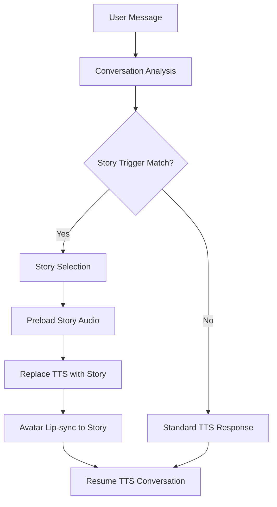

# Design Document

## Overview

The Authentic Voice Stories feature extends EchoStone's avatar system to support longer personal narratives (2-5 minutes) in the user's authentic recorded voice. This "super-expressions" system builds upon the existing expression infrastructure while introducing new data models, trigger matching, and playback orchestration to deliver seamless storytelling experiences.

The design leverages the existing `SimpleExpressionPlayer`, `ExpressionAudioMixer`, and `StreamingAudioManager` components while introducing a new `UserStoryService` for story-specific functionality. Stories integrate with the current ElevenLabs TTS pipeline using Option A (Replace TTS Entirely) for MVP implementation.

## Architecture

### System Integration Points

The authentic voice stories system integrates with existing EchoStone components:

1. **Database Layer**: Extends existing Supabase schema with new `user_stories` table
2. **Audio Pipeline**: Integrates with `StreamingAudioManager` and `ExpressionAudioMixer`
3. **Trigger System**: Extends conversation analysis for story keyword matching
4. **Storage**: Utilizes existing Supabase storage with CDN optimization
5. **API Layer**: New endpoints for story management and playback

### High-Level Flow



## Components and Interfaces

### Core Data Models

#### UserStory Interface
```typescript
interface UserStory {
  id: string;
  ownerId: string;
  ownerType: 'user' | 'avatar';
  title: string;
  category: 'memory' | 'experience' | 'advice' | 'anecdote';
  triggers: string[];
  audioUrl: string;
  duration: number; // milliseconds
  transcript?: string;
  priority: number; // 0-100, higher = more likely to trigger
  status: 'active' | 'inactive' | 'processing' | 'failed';
  createdAt: string;
  updatedAt: string;
}
```

#### StoryTriggerMatch Interface
```typescript
interface StoryTriggerMatch {
  story: UserStory;
  confidence: number; // 0-1, how well the trigger matches
  matchedKeywords: string[];
  contextRelevance: number; // 0-1, relevance to conversation context
}
```

#### StoryPlaybackOptions Interface
```typescript
interface StoryPlaybackOptions {
  fadeInMs?: number;
  fadeOutMs?: number;
  volumeLevel?: number; // 0-1
  enableLipSync?: boolean;
  fallbackToTTS?: boolean;
}
```

### Service Components

#### UserStoryService
Primary service for story management and playback orchestration:

```typescript
class UserStoryService {
  // Story Management
  async uploadStory(audioFile: File, metadata: StoryMetadata): Promise<UserStory>
  async getStoriesByOwner(ownerId: string, ownerType: 'user' | 'avatar'): Promise<UserStory[]>
  async updateStory(id: string, updates: Partial<UserStory>): Promise<UserStory>
  async deleteStory(id: string): Promise<boolean>
  
  // Trigger Matching
  async findMatchingStories(text: string, context: ConversationContext): Promise<StoryTriggerMatch[]>
  async selectBestStory(matches: StoryTriggerMatch[]): Promise<UserStory | null>
  
  // Playback Integration
  async preloadStoryAudio(story: UserStory): Promise<AudioBuffer>
  async integrateWithStreamingManager(manager: StreamingAudioManager): Promise<void>
}
```

#### StoryTriggerMatcher
Handles keyword matching and context analysis:

```typescript
class StoryTriggerMatcher {
  async analyzeText(text: string): Promise<string[]> // Extract keywords
  async matchTriggers(keywords: string[], stories: UserStory[]): Promise<StoryTriggerMatch[]>
  async calculateRelevance(story: UserStory, context: ConversationContext): Promise<number>
  async applyThrottling(matches: StoryTriggerMatch[]): Promise<StoryTriggerMatch[]>
}
```

#### StoryAudioManager
Manages story audio playback and TTS integration:

```typescript
class StoryAudioManager {
  async replaceNextTTSWithStory(story: UserStory, streamingManager: StreamingAudioManager): Promise<void>
  async handleStoryPlayback(audioBuffer: AudioBuffer, options: StoryPlaybackOptions): Promise<void>
  async gracefulFallback(error: Error, fallbackText: string): Promise<void>
  async attemptLipSync(audioBuffer: AudioBuffer): Promise<void> // Best effort, fallback to idle animation
  async handleConcurrency(newStory: UserStory, currentStory?: UserStory): Promise<'queue' | 'skip' | 'interrupt'>
}
```

### Database Schema Extensions

#### user_stories Table (MVP Simplified)
```sql
CREATE TABLE user_stories (
  id UUID PRIMARY KEY DEFAULT gen_random_uuid(),
  owner_id VARCHAR(255) NOT NULL,
  owner_type VARCHAR(20) NOT NULL CHECK (owner_type IN ('user', 'avatar')),
  title VARCHAR(255) NOT NULL,
  category VARCHAR(50) NOT NULL CHECK (category IN ('memory', 'experience', 'advice', 'anecdote')),
  triggers TEXT NOT NULL, -- Comma-separated keywords (max 20), normalized lowercase
  audio_url TEXT NOT NULL,
  duration_ms INTEGER NOT NULL CHECK (duration_ms BETWEEN 30000 AND 300000),
  transcript TEXT,
  priority INTEGER DEFAULT 50 CHECK (priority BETWEEN 0 AND 100),
  status VARCHAR(20) DEFAULT 'active' CHECK (status IN ('active', 'inactive', 'processing', 'failed')),
  created_at TIMESTAMP WITH TIME ZONE DEFAULT NOW(),
  updated_at TIMESTAMP WITH TIME ZONE DEFAULT NOW(),
  CONSTRAINT max_stories_per_avatar CHECK (
    (SELECT COUNT(*) FROM user_stories WHERE owner_id = NEW.owner_id AND owner_type = NEW.owner_type) <= 5
  )
);

-- Simplified indexes for MVP
CREATE INDEX user_stories_owner_idx ON user_stories(owner_type, owner_id, status);
CREATE INDEX user_stories_triggers_text_idx ON user_stories(triggers); -- Simple text index
CREATE INDEX user_stories_priority_idx ON user_stories(priority DESC, status);
```

#### story_usage_analytics Table
```sql
CREATE TABLE story_usage_analytics (
  id UUID PRIMARY KEY DEFAULT gen_random_uuid(),
  story_id UUID REFERENCES user_stories(id) ON DELETE CASCADE,
  session_id VARCHAR(255),
  trigger_text TEXT,
  matched_keywords TEXT[],
  confidence_score DECIMAL(3,2),
  played_successfully BOOLEAN DEFAULT FALSE,
  playback_duration_ms INTEGER,
  error_message TEXT,
  created_at TIMESTAMP WITH TIME ZONE DEFAULT NOW()
);
```

## Data Models

### Story Storage Strategy

Stories are stored using the existing Supabase storage infrastructure with CDN optimization:

1. **File Storage**: MP3 files stored in `stories` bucket with path structure: `{ownerType}/{ownerId}/{storyId}.mp3`
2. **CDN Delivery**: Leverage Supabase CDN with cache headers for fast global delivery
3. **Compression**: Audio files processed to optimize for web delivery (128kbps MP3, normalized levels)
4. **Metadata**: Story metadata stored in PostgreSQL with full-text search on triggers and transcripts

### Trigger Matching Algorithm (MVP Simplified)

The trigger matching system uses a simplified approach for MVP:

1. **Case-Insensitive Keyword Match**: Direct string matching against story triggers
2. **Priority Scoring**: Apply story priority weights (0-100)
3. **Throttling**: Prevent story spam with 30-second cooldown between stories
4. **Concurrency Rule**: If story is playing, queue new triggers (no interruption)
5. **Future Enhancement**: Fuzzy matching and context weighting in later versions

### Audio Processing Pipeline

Stories follow a standardized audio processing pipeline:

1. **Upload Validation**: Check file format, duration, and size constraints
2. **Audio Normalization**: Normalize levels to -14 LUFS for consistent playback
3. **Format Conversion**: Convert to optimized MP3 (128kbps, 44.1kHz)
4. **CDN Upload**: Store processed audio with immutable cache headers
5. **Metadata Extraction**: Extract duration, sample rate, and quality metrics

## Error Handling

### Graceful Degradation Strategy

The system implements comprehensive error handling with graceful degradation:

#### Story Loading Failures
- **Network Issues**: Retry with exponential backoff, fallback to TTS after 2 seconds
- **Audio Decode Errors**: Log error, mark story as failed, use TTS response
- **Storage Unavailable**: Skip story playback, continue with normal conversation flow

#### Trigger Matching Failures
- **Database Timeout**: Use cached story list, log performance issue
- **Analysis Errors**: Skip story matching, continue with TTS
- **No Matches Found**: Normal TTS flow, no user-visible impact

#### Playback Integration Failures
- **AudioContext Issues**: Fallback to HTML Audio, then to TTS within 2s timeout
- **Lip-sync Limitations**: Continue audio playback with idle avatar animation
- **Timing Issues**: Abandon story playback, immediately start TTS fallback
- **Concurrency Conflicts**: Queue new story triggers, never interrupt current playback

### Error Recovery Mechanisms

```typescript
interface ErrorRecoveryConfig {
  maxRetries: number;
  retryDelayMs: number;
  fallbackTimeoutMs: number;
  enableFallbackTTS: boolean;
  logErrors: boolean;
}

class StoryErrorHandler {
  async handleLoadingError(story: UserStory, error: Error): Promise<void>
  async handlePlaybackError(story: UserStory, error: Error): Promise<void>
  async executeGracefulFallback(fallbackText: string): Promise<void>
  async reportErrorMetrics(error: Error, context: ErrorContext): Promise<void>
}
```

## Testing Strategy

### Unit Testing

1. **StoryTriggerMatcher**: Test keyword extraction, fuzzy matching, and scoring algorithms
2. **UserStoryService**: Test CRUD operations, validation, and error handling
3. **StoryAudioManager**: Test audio processing, playback integration, and fallback mechanisms
4. **Database Operations**: Test queries, indexes, and constraint validation

### Integration Testing

1. **End-to-End Story Flow**: Test complete story trigger → playback → resume TTS flow
2. **Audio Pipeline**: Test upload → processing → CDN delivery → playback chain
3. **Error Scenarios**: Test network failures, audio corruption, and timeout handling
4. **Performance**: Test story loading times, trigger matching speed, and memory usage

### Performance Testing

1. **Trigger Matching Latency**: Ensure < 100ms p95 for story matching queries
2. **Audio Loading Speed**: Verify < 2s p95 for story playback start
3. **Memory Usage**: Monitor audio buffer memory consumption and cleanup
4. **Concurrent Users**: Test system behavior under multiple simultaneous story requests

### User Acceptance Testing

1. **Story Upload Flow**: Test story creation, editing, and management interfaces
2. **Conversation Integration**: Verify natural story triggering and playback
3. **Audio Quality**: Validate story audio quality and lip-sync accuracy
4. **Error Handling**: Test user experience during various failure scenarios

### Automated Testing Pipeline

```typescript
interface TestSuite {
  unitTests: {
    triggerMatching: TestCase[];
    audioProcessing: TestCase[];
    databaseOperations: TestCase[];
  };
  integrationTests: {
    endToEndFlow: TestCase[];
    errorScenarios: TestCase[];
    performanceTests: TestCase[];
  };
  loadTests: {
    concurrentUsers: number;
    storyLoadTime: number;
    triggerMatchingLatency: number;
  };
}
```

## Performance Considerations

### Optimization Strategies (MVP Focus)

1. **Conservative Preloading**: Preload only one story at a time based on highest-priority trigger match
2. **CDN Caching**: Leverage Supabase CDN with immutable cache headers for story audio
3. **Audio Compression**: Standardized 128kbps MP3, -14 LUFS normalization
4. **Graceful Fallback**: Always fallback to TTS if story loading exceeds 2s timeout
5. **Mobile Optimization**: Limit concurrent audio buffers to prevent mobile Safari memory issues

### Scalability Measures

1. **CDN Distribution**: Global CDN for low-latency story delivery
2. **Database Indexing**: Optimized indexes for trigger matching and story queries
3. **Memory Management**: Efficient audio buffer lifecycle management
4. **Rate Limiting**: Prevent abuse while maintaining responsive user experience
5. **Monitoring**: Comprehensive metrics for performance tracking and alerting

### Resource Management

```typescript
interface ResourceLimits {
  maxStoriesPerAvatar: number; // 5 stories per avatar (MVP limit)
  maxAudioFileSize: number; // 10MB per story
  maxConcurrentLoads: number; // 1 simultaneous story load (MVP)
  audioBufferCacheSize: number; // 15MB total cache (mobile-friendly)
  triggerMatchingTimeout: number; // 100ms timeout
  storyPlaybackTimeout: number; // 2s max delay before TTS fallback
  storyCooldownMs: number; // 30s between story triggers
}
```