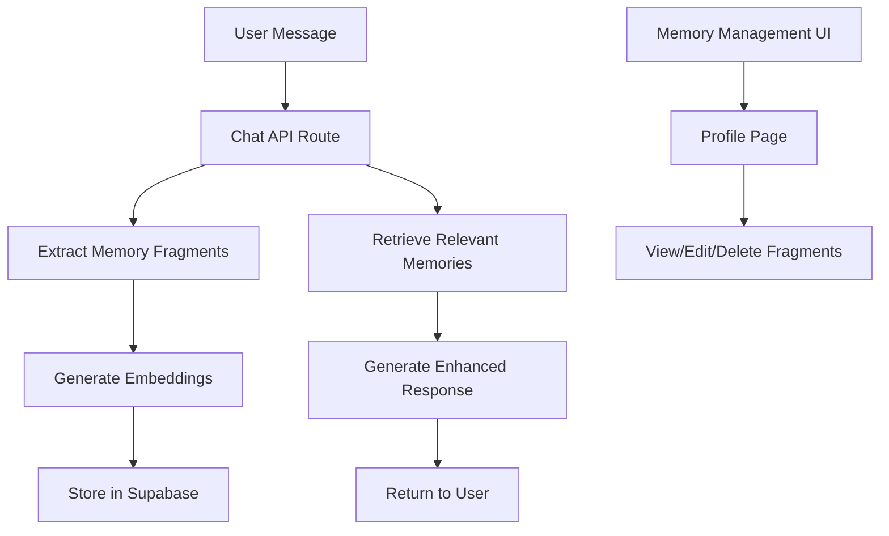

# Design Document

## Overview

The EchoStone conversation memory system extends the existing chat infrastructure to capture, store, and retrieve meaningful conversation fragments using semantic search. The system integrates seamlessly with the current OpenAI-powered chat API and Supabase database, adding long-term memory capabilities without disrupting the existing user experience.

The design leverages OpenAI's embedding models for semantic similarity matching and Supabase's pgvector extension for efficient vector storage and retrieval. Memory fragments are automatically extracted from conversations, stored with user-specific isolation, and retrieved contextually to enhance avatar responses.

## Architecture

### High-Level Flow



### System Integration Points

1. **Chat API Enhancement**: Extend existing `/api/chat/route.ts` to include memory operations
2. **Database Extension**: Add memory_fragments table to existing Supabase schema
3. **Profile Integration**: Add memory management to existing profile pages
4. **Embedding Service**: New service for OpenAI embedding operations

## Components and Interfaces

### Database Schema

**Table: memory_fragments**
```sql
CREATE TABLE memory_fragments (
  id UUID PRIMARY KEY DEFAULT uuid_generate_v4(),
  user_id UUID NOT NULL REFERENCES auth.users(id) ON DELETE CASCADE,
  fragment_text TEXT NOT NULL,
  embedding vector(1536) NOT NULL,
  conversation_context JSONB,
  created_at TIMESTAMP WITH TIME ZONE DEFAULT NOW(),
  updated_at TIMESTAMP WITH TIME ZONE DEFAULT NOW()
);

-- Enable pgvector extension
CREATE EXTENSION IF NOT EXISTS vector;

-- Create index for semantic search
CREATE INDEX memory_fragments_embedding_idx ON memory_fragments 
USING ivfflat (embedding vector_cosine_ops) WITH (lists = 100);

-- Create index for user-specific queries
CREATE INDEX memory_fragments_user_id_idx ON memory_fragments (user_id);
```

### API Interfaces

**Memory Service Interface**
```typescript
interface MemoryService {
  extractMemoryFragments(message: string, userId: string): Promise<MemoryFragment[]>
  storeMemoryFragment(fragment: MemoryFragment): Promise<void>
  retrieveRelevantMemories(query: string, userId: string, limit?: number): Promise<MemoryFragment[]>
  deleteMemoryFragment(fragmentId: string, userId: string): Promise<void>
  getUserMemories(userId: string): Promise<MemoryFragment[]>
}

interface MemoryFragment {
  id?: string
  userId: string
  fragmentText: string
  embedding?: number[]
  conversationContext?: {
    timestamp: string
    messageContext: string
    emotionalTone?: string
  }
  createdAt?: Date
  updatedAt?: Date
}
```

**Enhanced Chat API**
```typescript
interface ChatRequest {
  prompt: string
  voiceId?: string
  systemPrompt?: string
  profileData?: any
  includeMemories?: boolean // New field
}

interface ChatResponse {
  answer: string
  voiceId?: string
  memoriesUsed?: MemoryFragment[] // New field for transparency
}
```

### Frontend Components

**Memory Management Component**
```typescript
interface MemoryManagementProps {
  userId: string
  memories: MemoryFragment[]
  onEdit: (fragment: MemoryFragment) => void
  onDelete: (fragmentId: string) => void
}
```

## Data Models

### Memory Fragment Processing

1. **Extraction Logic**: Use GPT-4 to identify meaningful personal information from user messages
2. **Embedding Generation**: Convert fragments to 1536-dimensional vectors using OpenAI's text-embedding-3-small
3. **Storage Format**: Store as structured JSON with metadata for context and retrieval

### Semantic Search Strategy

1. **Query Embedding**: Convert current user message to embedding vector
2. **Similarity Search**: Use cosine similarity to find relevant fragments
3. **Relevance Filtering**: Apply threshold to ensure only meaningful matches are included
4. **Context Integration**: Blend retrieved memories with existing personality data

### Privacy and Data Isolation

1. **User-Specific Storage**: All fragments tied to authenticated user ID
2. **Access Control**: Row-level security policies in Supabase
3. **Data Encryption**: Leverage Supabase's built-in encryption at rest
4. **Retention Policies**: User-controlled deletion and export capabilities

## Error Handling

### Memory Operations Error Handling

1. **Extraction Failures**: Continue conversation flow if memory extraction fails
2. **Storage Failures**: Log errors but don't interrupt user experience
3. **Retrieval Failures**: Gracefully degrade to personality-only responses
4. **Embedding API Failures**: Implement retry logic with exponential backoff

### Database Error Handling

1. **Connection Issues**: Implement connection pooling and retry mechanisms
2. **Vector Search Failures**: Fall back to text-based search or skip memory retrieval
3. **Schema Migrations**: Version-controlled database migrations for pgvector setup

### User Experience Error Handling

1. **Memory Management UI**: Clear error messages for failed operations
2. **Graceful Degradation**: System works without memories if service unavailable
3. **Data Consistency**: Ensure partial failures don't leave inconsistent state

## Testing Strategy

### Unit Testing

1. **Memory Service Tests**: Test extraction, storage, and retrieval functions
2. **Embedding Tests**: Verify embedding generation and similarity calculations
3. **Database Tests**: Test CRUD operations and vector search functionality
4. **API Tests**: Test enhanced chat endpoints with memory integration

### Integration Testing

1. **End-to-End Flow**: Test complete conversation with memory capture and retrieval
2. **Database Integration**: Test Supabase operations with real vector data
3. **OpenAI Integration**: Test embedding API calls and error handling
4. **User Authentication**: Test memory isolation between users

### Performance Testing

1. **Vector Search Performance**: Test query response times with various data sizes
2. **Memory Extraction Speed**: Ensure extraction doesn't slow conversation flow
3. **Concurrent User Testing**: Test system under multiple simultaneous users
4. **Database Scaling**: Test performance with large numbers of memory fragments

### User Acceptance Testing

1. **Memory Accuracy**: Verify extracted memories are relevant and accurate
2. **Retrieval Relevance**: Test that retrieved memories enhance conversation quality
3. **Privacy Controls**: Verify users can manage their memory data effectively
4. **Conversation Flow**: Ensure memory integration feels natural and seamless