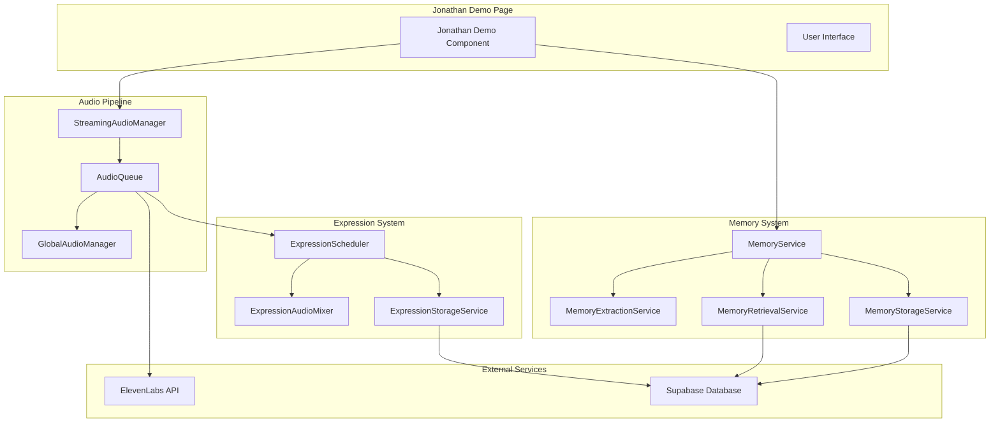

# Design Document

## Overview

This design transforms EchoStone's jonathan-demo from a high-latency, one-shot TTS system to a responsive streaming audio experience with intelligent expression overlays and persistent memory. The solution integrates existing StreamingAudioManager capabilities with enhanced voice quality, normalized expression overlays, and Supabase-backed conversational memory.

## Design Goals

### Primary Objectives
1. **Sub-second Response Latency**: Replace 3-5 second TTS delays with streaming audio that begins within 500ms
2. **Natural Expression Integration**: Seamlessly blend vocal expressions (laughter, sighs, "hmm") with TTS without interrupting flow
3. **Premium Voice Quality**: Upgrade from thin/metallic mp3_22050_32 to rich 44.1kHz streaming with proper prosody
4. **Persistent Conversational Memory**: Enable cross-session memory continuity via Supabase MemoryService
5. **User-Friendly Expression Management**: Simplify expression upload and management without technical complexity

### Success Metrics
- First audio byte delivery: <1 second (vs current 3-5 seconds)
- Expression overlay timing accuracy: ±50ms
- Voice quality improvement: Eliminate metallic artifacts, achieve natural prosody
- Memory retrieval overhead: <200ms
- Mobile Safari compatibility: Single-gesture audio activation

## Architecture

### System Flow Diagram

```mermaid
sequenceDiagram
    participant U as User
    participant JD as Jonathan Demo
    participant SAM as StreamingAudioManager
    participant MS as MemoryService
    participant EL as ElevenLabs API
    participant ES as ExpressionScheduler
    participant EAM as ExpressionAudioMixer

    U->>JD: Send message
    JD->>MS: Retrieve relevant memories (parallel)
    JD->>+EL: Start streaming chat response
    
    par Memory Retrieval
        MS-->>JD: Return memory context (<200ms)
    and TTS Streaming
        EL-->>SAM: Stream sentence chunks
        SAM->>ES: Schedule expressions (non-blocking)
        ES-->>EAM: Queue overlay audio
        SAM->>U: Play TTS audio (<500ms first byte)
        EAM-->>U: Play expression overlays (ducked)
    end
    
    JD->>MS: Store new memories (async)
    SAM->>-U: Complete audio playback
```

### Component Architecture



## Components and Interfaces

### 1. Enhanced Jonathan Demo Integration

**File**: `src/app/jonathan-demo/page.tsx`

**Key Changes**:
- Replace one-shot TTS with StreamingAudioManager
- Integrate memory retrieval for conversation context
- Add expression pack initialization
- Implement streaming response processing

**New Interface**:
```typescript
interface JonathanDemoState {
  streamingManager: StreamingAudioManager | null;
  memoryContext: string;
  expressionPack: StoredExpression[];
  conversationId: string;
}
```

### 2. StreamingAudioManager Enhancement

**File**: `src/lib/streamingUtils.ts` (existing, enhanced)

**Current Capabilities**:
- Sentence-by-sentence streaming
- Expression overlay integration
- Audio queue management
- Prefetching and caching

**Enhancements Needed**:
```typescript
interface StreamingAudioManagerConfig {
  voiceSettings: EnhancedVoiceSettings;
  memoryContext?: string;
  expressionPackId?: string;
  conversationId: string;
}

interface EnhancedVoiceSettings {
  sampleRate: 44100;
  bitrate: 128; // kbps minimum
  latencyMode: 3;
  format: 'mp3_44100_128';
  stability: 0.70;
  similarity_boost: 0.85;
  style: 0.00;
  use_speaker_boost: false;
}
```

### 3. Memory Integration Service

**File**: `src/lib/memoryService.ts` (existing, enhanced)

**Current Capabilities**:
- Memory extraction and storage
- Semantic similarity search
- Supabase integration

**Enhancement Interface**:
```typescript
interface ConversationMemoryManager {
  retrieveContextForResponse(
    query: string, 
    userId: string, 
    avatarId: string,
    maxTokens?: number
  ): Promise<string>;
  
  storeConversationTurn(
    userMessage: string,
    assistantResponse: string,
    userId: string,
    avatarId: string
  ): Promise<void>;
  
  getConversationSummary(
    userId: string,
    avatarId: string,
    lastNTurns?: number
  ): Promise<string>;
}
```

### 4. Expression Audio Mixer

**File**: `src/lib/expressionAudioMixer.ts` (existing)

**Current Capabilities**:
- Audio normalization to -14 LUFS
- Ducking and fade transitions
- Multi-expression scheduling

**Required Enhancements**:
```typescript
interface ExpressionMixerConfig {
  masterVolume: 1.0;
  duckingAmount: 0.4; // 3-6dB reduction
  fadeDurationMs: 50;
  maxConcurrentOverlays: 2;
  minSpacingMs: 4000;
  lufsTarget: -14;
}
```

### 5. Voice Configuration Service

**File**: `src/lib/enhancedVoiceConfig.ts` (new)

**Purpose**: Centralized high-quality voice configuration

```typescript
interface VoiceConfigService {
  getJonathanDemoConfig(): ElevenLabsStreamingConfig;
  validateVoiceQuality(audioBuffer: ArrayBuffer): Promise<QualityMetrics>;
  getFallbackConfig(): ElevenLabsStreamingConfig;
}

interface ElevenLabsStreamingConfig {
  model_id: 'eleven_multilingual_v2';
  voice_settings: {
    stability: 0.70;
    similarity_boost: 0.85;
    style: 0.00;
    use_speaker_boost: false;
  };
  output_format: 'mp3_44100_128';
  optimize_streaming_latency: 3;
  apply_text_normalization: 'auto';
}
```

## Data Models

### Enhanced Memory Fragment

```typescript
interface EnhancedMemoryFragment extends MemoryFragment {
  conversationTurn: number;
  emotionalContext: 'positive' | 'negative' | 'neutral' | 'excited' | 'contemplative';
  topicTags: string[];
  relevanceScore?: number;
  lastAccessed?: Date;
}
```

### Expression Pack Configuration

```typescript
interface ExpressionPackConfig {
  id: string;
  userId: string;
  avatarId: string;
  expressions: {
    [key in ExpressionType]: {
      clips: StoredExpression[];
      enabled: boolean;
      frequency: 'low' | 'medium' | 'high';
    };
  };
  globalSettings: {
    volume: number;
    duckingAmount: number;
    maxConcurrent: number;
  };
}
```

### Conversation State

```typescript
interface ConversationState {
  id: string;
  userId: string;
  avatarId: string;
  turns: ConversationTurn[];
  memoryContext: string;
  voiceSettings: EnhancedVoiceSettings;
  expressionPackId: string;
  lastActivity: Date;
}

interface ConversationTurn {
  id: string;
  userMessage: string;
  assistantResponse: string;
  timestamp: Date;
  audioLatency: number;
  expressionsUsed: string[];
  memoryFragmentsReferenced: string[];
}
```

## Error Handling

### Graceful Degradation Strategy

1. **Memory Service Failures**:
   - Fallback to conversation without memory context
   - Log error for debugging but continue operation
   - Cache last successful memory retrieval

2. **Expression System Failures**:
   - Continue TTS playback without expressions
   - Disable expression scheduling for current session
   - Provide user notification of reduced functionality

3. **Voice Quality Degradation**:
   - Automatic retry with fallback settings
   - Progressive quality reduction (128kbps → 64kbps → 32kbps)
   - Maintain minimum quality threshold

4. **Streaming Interruptions**:
   - Buffer management for network issues
   - Seamless fallback to buffered audio
   - User notification for extended outages

### Error Recovery Patterns

```typescript
interface ErrorRecoveryConfig {
  maxRetries: 3;
  backoffMultiplier: 1.5;
  fallbackStrategies: {
    memory: 'continue_without_context';
    expressions: 'disable_for_session';
    voice_quality: 'progressive_degradation';
    streaming: 'buffer_fallback';
  };
}
```

## Testing Strategy

### Unit Tests

1. **StreamingAudioManager Integration**
   - Verify sentence-by-sentence streaming
   - Test expression overlay timing
   - Validate memory integration

2. **Voice Quality Validation**
   - Audio format verification
   - Latency measurement
   - Quality metrics validation

3. **Memory Service Integration**
   - Context retrieval performance
   - Storage operation validation
   - Error handling verification

### Integration Tests

1. **End-to-End Conversation Flow**
   - User message → Memory retrieval → TTS streaming → Expression overlays
   - Cross-session memory persistence
   - Mobile Safari compatibility

2. **Performance Benchmarks**
   - First audio byte latency
   - Memory retrieval overhead
   - Expression scheduling performance

3. **Error Scenarios**
   - Network interruption handling
   - Service degradation responses
   - Recovery mechanism validation

### User Acceptance Testing

1. **Latency Perception**
   - A/B testing against current system
   - User satisfaction surveys
   - Conversation flow naturalness

2. **Expression Quality**
   - Overlay timing accuracy
   - Audio quality assessment
   - Natural conversation feel

3. **Memory Continuity**
   - Cross-session conversation validation
   - Memory accuracy verification
   - Context relevance assessment

## Performance Considerations

### Optimization Targets

1. **Audio Latency**
   - Target: <500ms first audio byte
   - Measurement: Performance.now() timestamps
   - Optimization: Parallel processing, prefetching

2. **Memory Retrieval**
   - Target: <200ms overhead
   - Measurement: Database query timing
   - Optimization: Caching, query optimization

3. **Expression Scheduling**
   - Target: <50ms scheduling time
   - Measurement: Scheduler execution time
   - Optimization: Simple keyword matching, precomputed schedules

### Resource Management

1. **Audio Buffer Management**
   - Automatic cleanup of completed audio
   - Memory leak prevention
   - Mobile device optimization

2. **Cache Strategy**
   - Memory fragment caching (5-minute TTL)
   - Expression buffer preloading
   - Voice setting persistence

3. **Network Optimization**
   - Streaming chunk size optimization
   - Compression for expression audio
   - CDN utilization for static assets

## Security and Privacy

### Data Protection

1. **Memory Storage**
   - User data isolation in Supabase
   - Encryption at rest and in transit
   - GDPR compliance for memory deletion

2. **Expression Audio**
   - User-uploaded content validation
   - Audio format sanitization
   - Privacy settings enforcement

3. **Voice Data**
   - No persistent storage of generated audio
   - Secure API key management
   - Rate limiting and abuse prevention

### Access Control

1. **Memory Access**
   - User-scoped memory retrieval
   - Avatar-specific memory isolation
   - Session-based access validation

2. **Expression Management**
   - User ownership validation
   - Privacy setting enforcement
   - Admin expression prioritization

## Deployment Strategy

### Rollout Plan

1. **Phase 1: Core Streaming (P0)**
   - Replace one-shot TTS with StreamingAudioManager
   - Implement enhanced voice settings
   - Basic error handling and fallbacks

2. **Phase 2: Expression Integration (P1)**
   - Add expression overlay system
   - Implement audio normalization
   - User expression upload interface

3. **Phase 3: Memory Enhancement (P1)**
   - Integrate persistent memory service
   - Cross-session conversation continuity
   - Memory management interface

4. **Phase 4: Polish and Optimization (P2)**
   - Performance optimization
   - Advanced error recovery
   - Analytics and monitoring

### Feature Flags

```typescript
interface FeatureFlags {
  STREAMING_AUDIO_ENABLED: boolean;
  EXPRESSION_OVERLAYS_ENABLED: boolean;
  PERSISTENT_MEMORY_ENABLED: boolean;
  ENHANCED_VOICE_QUALITY: boolean;
  MOBILE_OPTIMIZATIONS: boolean;
}
```

### Monitoring and Analytics

1. **Performance Metrics**
   - Audio latency distribution
   - Memory retrieval performance
   - Expression overlay accuracy

2. **User Experience Metrics**
   - Conversation completion rates
   - User satisfaction scores
   - Error recovery success rates

3. **System Health Metrics**
   - API response times
   - Error rates by component
   - Resource utilization patterns