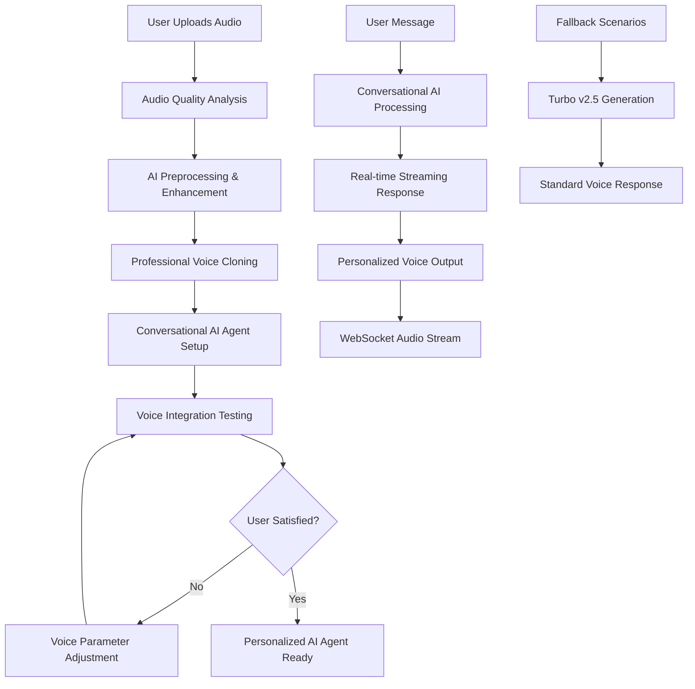

# Enhanced Voice System Design

## Overview

The Enhanced Voice System leverages ElevenLabs' most advanced capabilities including Conversational AI (Beta), Professional Voice Cloning API, and Turbo v2.5 model to create a revolutionary voice experience. The system uses ElevenLabs Conversational AI as the primary chat interface, enhanced with personalized voice cloning for authentic user representation. This hybrid approach delivers real-time, context-aware conversations with natural emotional intelligence while maintaining the user's unique voice characteristics.

## Architecture

### Core Components

1. **ElevenLabs Conversational AI Integration** - Primary chat interface with real-time streaming
2. **Professional Voice Cloning Service** - Handles advanced voice training with user's audio
3. **Hybrid Voice Management System** - Combines conversational AI with personalized voice cloning
4. **Voice Quality Optimizer** - Provides AI-powered audio enhancement and analysis
5. **Enhanced Onboarding Wizard** - Guides users through voice creation and AI agent setup
6. **Real-time Conversation Handler** - Manages streaming audio and interruption handling

### System Flow



## Components and Interfaces

### 1. Enhanced Voice Training Service

**Location:** `src/lib/enhancedVoiceService.ts`

```typescript
interface VoiceTrainingConfig {
  files: File[]
  name: string
  description: string
  settings: ProfessionalVoiceSettings
  emotionalCalibration: EmotionalCalibration
}

interface ProfessionalVoiceSettings {
  stability: number
  similarity_boost: number
  style: number
  use_speaker_boost: boolean
  optimize_streaming_latency: number
  model_id: 'eleven_turbo_v2_5' | 'eleven_multilingual_v2'
}

interface EmotionalCalibration {
  happy: VoiceParameters
  sad: VoiceParameters
  excited: VoiceParameters
  calm: VoiceParameters
  serious: VoiceParameters
  playful: VoiceParameters
}
```

### 2. ElevenLabs Conversational AI Integration

**Location:** `src/lib/conversationalAIService.ts`

```typescript
interface ConversationalAIConfig {
  agent_id: string
  voice_id: string
  knowledge_base: string[]
  personality_prompt: string
  conversation_config: ConversationConfig
}

interface ConversationConfig {
  language: string
  response_format: 'audio' | 'text' | 'both'
  max_duration: number
  interruption_threshold: number
  stability: number
  similarity_boost: number
  style: number
  use_speaker_boost: boolean
}

interface ConversationalAIResponse {
  audio_url?: string
  text: string
  conversation_id: string
  user_input_duration: number
  response_duration: number
}

interface WebSocketMessage {
  type: 'audio_chunk' | 'text_chunk' | 'conversation_end' | 'error'
  data: any
  conversation_id: string
}
```

### 3. Hybrid Voice Management Service

**Location:** `src/lib/hybridVoiceService.ts`

```typescript
interface HybridVoiceConfig {
  conversational_ai_enabled: boolean
  fallback_to_turbo: boolean
  voice_id: string
  agent_id?: string
  personality_integration: PersonalityIntegration
}

interface PersonalityIntegration {
  profile_data: UserProfile
  conversation_style: ConversationStyle
  emotional_preferences: EmotionalPreferences
  knowledge_base_entries: string[]
}

interface ConversationStyle {
  formality: 'casual' | 'professional' | 'mixed'
  humor_level: number
  empathy_level: number
  response_length: 'short' | 'medium' | 'long'
}
```

### 3. Voice Quality Optimizer

**Location:** `src/lib/voiceQualityOptimizer.ts`

```typescript
interface AudioAnalysis {
  quality_score: number
  noise_level: number
  clarity_score: number
  duration: number
  sample_rate: number
  recommendations: string[]
}

interface AudioEnhancement {
  noise_reduction: boolean
  volume_normalization: boolean
  clarity_enhancement: boolean
  format_optimization: boolean
}
```

### 4. Enhanced Onboarding Wizard

**Location:** `src/components/EnhancedVoiceOnboarding.tsx`

```typescript
interface OnboardingStep {
  id: string
  title: string
  description: string
  component: React.ComponentType
  validation: (data: any) => boolean
  tips: string[]
}

interface OnboardingState {
  currentStep: number
  audioFiles: File[]
  recordedAudio: Blob | null
  qualityAnalysis: AudioAnalysis[]
  voiceSettings: ProfessionalVoiceSettings
  emotionalCalibration: EmotionalCalibration
}
```

### 5. Voice Management Dashboard

**Location:** `src/components/VoiceManagementDashboard.tsx`

```typescript
interface VoiceProfile {
  id: string
  name: string
  created_at: string
  settings: ProfessionalVoiceSettings
  emotional_calibration: EmotionalCalibration
  quality_metrics: QualityMetrics
  usage_stats: UsageStats
}

interface QualityMetrics {
  overall_score: number
  emotional_range: number
  clarity: number
  naturalness: number
}
```

## Data Models

### Enhanced Voice Profile Schema

```sql
-- Extension to existing profiles table
ALTER TABLE profiles ADD COLUMN voice_profile JSONB;

-- Voice profile structure
{
  "voice_id": "string",
  "professional_settings": {
    "stability": 0.75,
    "similarity_boost": 0.85,
    "style": 0.2,
    "use_speaker_boost": true,
    "model_id": "eleven_turbo_v2_5"
  },
  "emotional_calibration": {
    "happy": { "stability": 0.6, "similarity_boost": 0.8, "style": 0.4 },
    "sad": { "stability": 0.8, "similarity_boost": 0.9, "style": 0.1 },
    "excited": { "stability": 0.5, "similarity_boost": 0.7, "style": 0.6 },
    "calm": { "stability": 0.9, "similarity_boost": 0.85, "style": 0.1 },
    "serious": { "stability": 0.85, "similarity_boost": 0.9, "style": 0.05 },
    "playful": { "stability": 0.6, "similarity_boost": 0.75, "style": 0.5 }
  },
  "quality_metrics": {
    "overall_score": 8.5,
    "emotional_range": 9.0,
    "clarity": 8.8,
    "naturalness": 8.7
  },
  "created_at": "2025-01-16T10:00:00Z",
  "last_updated": "2025-01-16T10:00:00Z"
}
```

### Voice Training Sessions

```sql
CREATE TABLE voice_training_sessions (
  id UUID PRIMARY KEY DEFAULT gen_random_uuid(),
  user_id UUID REFERENCES auth.users(id),
  session_data JSONB NOT NULL,
  audio_files TEXT[] NOT NULL,
  quality_analysis JSONB NOT NULL,
  status TEXT NOT NULL DEFAULT 'pending',
  created_at TIMESTAMP WITH TIME ZONE DEFAULT NOW(),
  completed_at TIMESTAMP WITH TIME ZONE
);
```

## Error Handling

### Voice Training Errors

1. **Audio Quality Issues**
   - Automatic enhancement attempts
   - Specific feedback with improvement suggestions
   - Fallback to basic training with warnings

2. **API Rate Limiting**
   - Intelligent retry with exponential backoff
   - Queue management for multiple requests
   - User notification of delays

3. **Voice Generation Failures**
   - Fallback to default voice parameters
   - Error logging with context preservation
   - Graceful degradation to text responses

### Error Recovery Strategies

```typescript
interface ErrorRecoveryConfig {
  maxRetries: number
  backoffMultiplier: number
  fallbackVoiceId: string
  gracefulDegradation: boolean
}

class VoiceErrorHandler {
  async handleTrainingError(error: VoiceTrainingError): Promise<VoiceTrainingResult>
  async handleGenerationError(error: VoiceGenerationError): Promise<AudioBuffer | null>
  async recoverFromRateLimit(request: VoiceRequest): Promise<VoiceResponse>
}
```

## Testing Strategy

### Unit Tests

1. **Voice Service Tests**
   - Audio processing functions
   - Parameter calculation algorithms
   - Error handling scenarios

2. **Component Tests**
   - Onboarding wizard flow
   - Voice management interface
   - Audio quality feedback

### Integration Tests

1. **ElevenLabs API Integration**
   - Professional voice cloning workflow
   - Contextual voice generation
   - Error handling and recovery

2. **End-to-End Voice Flow**
   - Complete onboarding process
   - Voice training to generation pipeline
   - Emotional context adaptation

### Performance Tests

1. **Audio Processing Performance**
   - Large file handling
   - Concurrent training sessions
   - Memory usage optimization

2. **Voice Generation Latency**
   - Response time measurements
   - Streaming optimization
   - Cache effectiveness

## Implementation Phases

### Phase 1: Core Infrastructure
- Enhanced voice training service
- Professional API integration
- Audio quality optimizer

### Phase 2: Emotional Intelligence
- Contextual voice generation
- Emotional parameter calibration
- Context analysis service

### Phase 3: User Experience
- Enhanced onboarding wizard
- Voice management dashboard
- Real-time preview system

### Phase 4: Optimization & Polish
- Performance optimization
- Advanced error handling
- Analytics and monitoring

## Security Considerations

1. **Audio Data Protection**
   - Encrypted storage of voice samples
   - Secure transmission to ElevenLabs
   - Automatic cleanup of temporary files

2. **API Key Management**
   - Secure environment variable handling
   - Rate limiting protection
   - Usage monitoring and alerts

3. **User Privacy**
   - Opt-in voice data collection
   - Clear data retention policies
   - User control over voice profile deletion

## Performance Optimization

1. **Caching Strategy**
   - Voice parameter caching
   - Generated audio caching
   - Context analysis caching

2. **Streaming Optimization**
   - Real-time audio streaming
   - Progressive enhancement
   - Bandwidth adaptation

3. **Resource Management**
   - Memory-efficient audio processing
   - Concurrent request handling
   - Background processing queues