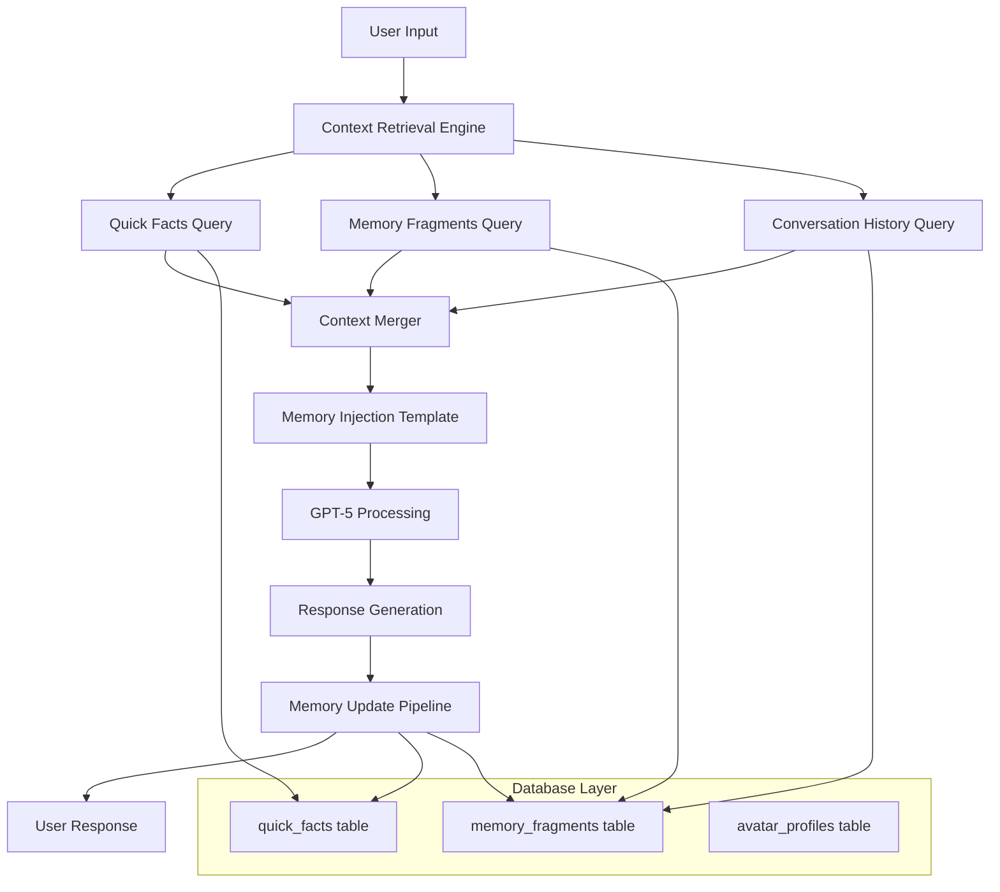

# Design Document

## Overview

The GPT-5 Avatar Memory Upgrade transforms EchoStone's avatar conversation system by integrating GPT-5 as the core reasoning engine with a sophisticated memory retrieval and context management system. This design addresses critical issues with fact recall, conversation continuity, and database schema inconsistencies while establishing a robust foundation for intelligent, personalized avatar interactions.

The system implements a three-tier memory architecture: quick_facts for high-priority identity data, memory_fragments for experiential content, and session-based conversation history. All context is merged through a structured memory injection template before being processed by GPT-5, ensuring consistent, accurate, and contextually aware responses.

## Architecture

### High-Level System Flow



### Core Components

1. **GPT-5 Integration Layer**: Handles all reasoning and response generation
2. **Context Retrieval Engine**: Orchestrates data fetching from multiple sources
3. **Memory Injection Template**: Structures context data for GPT-5 consumption
4. **Memory Update Pipeline**: Automatically stores new information from conversations
5. **Database Schema Compatibility Layer**: Ensures correct table and column references

## Components and Interfaces

### GPT-5 Integration Service

```typescript
interface GPT5Service {
  generateResponse(context: StructuredContext, userInput: string): Promise<GPT5Response>;
  validateResponse(response: string, context: StructuredContext): boolean;
}

interface GPT5Response {
  text: string;
  confidence: number;
  extractedFacts: ExtractedFact[];
  modelUsed: string;
  processingTime: number;
}
```

### Context Retrieval Engine

```typescript
interface ContextRetrievalEngine {
  retrieveContext(avatarId: string, query: string, options: RetrievalOptions): Promise<StructuredContext>;
  optimizeQuery(query: string): QueryOptimization;
}

interface StructuredContext {
  quickFacts: QuickFact[];
  memoryFragments: MemoryFragment[];
  conversationHistory: ConversationTurn[];
  retrievalMetadata: RetrievalMetadata;
}

interface RetrievalOptions {
  priorityFilter: number;
  memoryLimit: number;
  historyLimit: number;
  fastMode: boolean;
}
```

### Memory Injection Template

```typescript
interface MemoryInjectionTemplate {
  formatContext(context: StructuredContext): string;
  validateTemplate(template: string): boolean;
  optimizeForModel(template: string, modelType: string): string;
}

interface TemplateStructure {
  coreIdentity: QuickFact[];
  contextualFacts: QuickFact[];
  relevantMemories: MemoryFragment[];
  conversationHistory: ConversationTurn[];
  instructions: string[];
}
```

### Memory Update Pipeline

```typescript
interface MemoryUpdatePipeline {
  extractNewFacts(userInput: string, assistantResponse: string): Promise<ExtractedFact[]>;
  updateQuickFacts(avatarId: string, facts: ExtractedFact[]): Promise<void>;
  updateMemoryFragments(avatarId: string, content: string, context: ConversationContext): Promise<void>;
  resolveConflicts(existingFact: QuickFact, newFact: ExtractedFact): QuickFact;
}

interface ExtractedFact {
  key: string;
  value: string;
  confidence: number;
  priority: number;
  source: string;
  sourceReference: string;
}
```

## Data Models

### Enhanced Quick Facts Model

```typescript
interface QuickFact {
  id: string;
  avatarId: string;
  key: string;
  value: string;
  confidence: number; // 0.0 to 1.0
  priority: number; // 1 (highest) to 10 (lowest)
  source: 'heuristic' | 'llm' | 'manual' | 'extraction';
  sourceReference?: string;
  dateContext?: {
    year?: number;
    month?: number;
    day?: number;
  };
  expiresAt?: string;
  createdAt: string;
  updatedAt: string;
  category?: string;
}
```

### Enhanced Memory Fragment Model

```typescript
interface MemoryFragment {
  id: string;
  userId?: string;
  avatarId: string;
  fragmentText: string;
  embedding?: number[];
  conversationContext: {
    source: string;
    type: 'user' | 'assistant';
    conversationId: string;
    visitorId?: string;
    gist?: string;
    tags?: string[];
    title?: string;
    people?: string[];
    startDate?: string;
    endDate?: string;
    year?: number;
  };
  similarity?: number;
  createdAt: string;
  updatedAt: string;
}
```

### Conversation Context Model

```typescript
interface ConversationTurn {
  role: 'user' | 'assistant';
  content: string;
  timestamp: string;
  metadata?: {
    confidence?: number;
    extractedEntities?: string[];
    emotionalTone?: string;
  };
}

interface ConversationSession {
  sessionId: string;
  avatarId: string;
  visitorId: string;
  turns: ConversationTurn[];
  startTime: string;
  lastActivity: string;
  context: Record<string, any>;
}
```

## Error Handling

### Database Schema Compatibility

The system addresses current schema inconsistencies through a compatibility layer:

1. **Table Name Resolution**: Maps `avatars` references to `avatar_profiles`
2. **Column Name Validation**: Ensures all queries use existing column names
3. **Join Qualification**: All joins use explicit table prefixes to avoid ambiguity
4. **Constraint Compliance**: Validates all inserts against table constraints

```typescript
interface SchemaCompatibilityLayer {
  resolveTableName(legacyName: string): string;
  validateColumnExists(table: string, column: string): boolean;
  qualifyJoinColumns(query: string): string;
  validateConstraints(table: string, data: Record<string, any>): ValidationResult;
}
```

### Graceful Degradation Strategy

1. **Context Retrieval Failures**: Fall back to cached data or minimal context
2. **GPT-5 API Failures**: Retry with exponential backoff, fall back to GPT-4
3. **Memory Update Failures**: Queue updates for retry, continue conversation
4. **Database Connection Issues**: Use in-memory cache, sync when reconnected

### Conflict Resolution

```typescript
interface ConflictResolver {
  resolveFactConflict(existing: QuickFact, incoming: ExtractedFact): QuickFact;
  handleAmbiguousReferences(query: string, candidates: QuickFact[]): QuickFact[];
  prioritizeContextSources(sources: ContextSource[]): ContextSource[];
}

interface ConflictResolutionRules {
  priorityWeighting: number; // Higher priority wins
  confidenceThreshold: number; // Minimum confidence to override
  recencyBonus: number; // Bonus for newer information
  sourceReliability: Record<string, number>; // Source reliability scores
}
```

## Testing Strategy

### Unit Testing

1. **Context Retrieval Tests**: Verify correct data fetching and merging
2. **Memory Injection Tests**: Validate template formatting and structure
3. **Fact Extraction Tests**: Test automatic fact detection and categorization
4. **Conflict Resolution Tests**: Ensure proper handling of contradictory information

### Integration Testing

1. **End-to-End Conversation Flow**: Complete user input to response cycle
2. **Database Schema Compatibility**: Verify all queries work with current schema
3. **GPT-5 Integration**: Test API calls and response processing
4. **Memory Persistence**: Validate fact and memory storage

### Performance Testing

1. **Response Time Benchmarks**: Target <1.5s text, <3s TTS
2. **Concurrent User Load**: Test system under multiple simultaneous conversations
3. **Memory Retrieval Optimization**: Benchmark query performance
4. **Cache Effectiveness**: Measure cache hit rates and performance gains

### Accuracy Testing

1. **Fact Recall Validation**: Verify stored facts are correctly referenced
2. **Context Continuity**: Test conversation history maintenance
3. **Hallucination Prevention**: Ensure responses stay grounded in stored data
4. **Entity Resolution**: Test proper handling of pronouns and references

## Implementation Phases

### Phase 1: Core Infrastructure
- GPT-5 integration service
- Database schema compatibility layer
- Basic context retrieval engine
- Memory injection template

### Phase 2: Memory Management
- Automatic fact extraction
- Memory update pipeline
- Conflict resolution system
- Performance optimization

### Phase 3: Advanced Features
- Expression and personality management
- Geo-aware memory retrieval
- Advanced caching strategies
- Real-time conversation state management

### Phase 4: Optimization & Monitoring
- Performance monitoring
- Response quality metrics
- User experience analytics
- System health dashboards

## Performance Considerations

### Caching Strategy

1. **Quick Facts Cache**: 30-second TTL for frequently accessed facts
2. **Memory Fragment Cache**: LRU cache for recent queries
3. **Template Cache**: Pre-compiled templates for common scenarios
4. **Avatar Profile Cache**: Long-lived cache for avatar metadata

### Query Optimization

1. **Parallel Retrieval**: Fetch facts, memories, and history concurrently
2. **Selective Loading**: Only load relevant data based on query analysis
3. **Index Utilization**: Ensure all queries use appropriate database indexes
4. **Connection Pooling**: Optimize database connection management

### Response Time Targets

- Text-only responses: <1.5 seconds
- TTS responses: <3.0 seconds
- Context retrieval: <500ms
- Memory updates: <200ms (async)

## Security and Privacy

### Data Protection

1. **Row-Level Security**: Maintain existing RLS policies
2. **Data Encryption**: Encrypt sensitive personal information
3. **Access Control**: Service-level permissions for system operations
4. **Audit Logging**: Track all memory updates and access patterns

### Privacy Compliance

1. **Data Minimization**: Only store necessary information
2. **Retention Policies**: Automatic cleanup of expired data
3. **User Control**: Allow users to view and delete their data
4. **Anonymization**: Remove PII from system logs and analytics