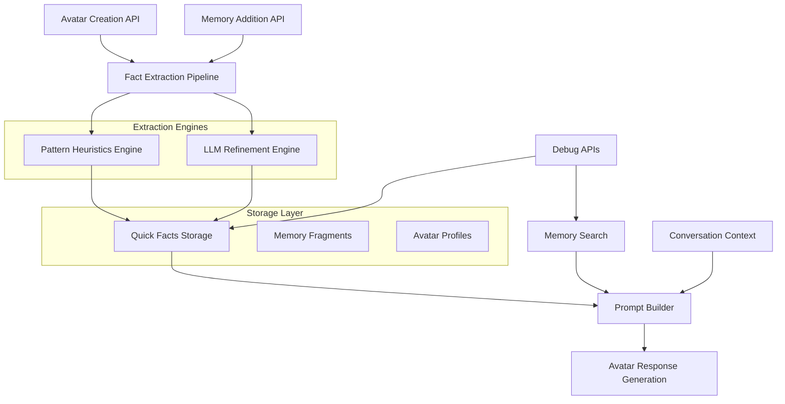

# Design Document

## Overview

The Hot Facts Extraction & Persona Pipeline is designed as a multi-layered system that automatically extracts, stores, and injects key identity facts for avatars in the EchoStone platform. The system operates on the principle of creating a "hot tier" of essential facts that are always available during avatar interactions, preventing hallucination and ensuring consistency.

The architecture follows a pipeline approach: **Ingestion → Extraction → Storage → Retrieval → Injection**, with each stage optimized for performance and reliability. The system integrates seamlessly with the existing avatar creation flow and memory management system while maintaining strict multi-tenant isolation.

## Architecture

### System Components



### Data Flow Architecture

1. **Ingestion Layer**: Receives avatar creation requests and memory additions
2. **Extraction Layer**: Processes text through pattern matching and optional LLM refinement
3. **Storage Layer**: Persists facts in optimized quick_facts table with proper indexing
4. **Retrieval Layer**: Fetches facts with sub-100ms performance for prompt building
5. **Injection Layer**: Combines facts with memories and context for consistent responses

### Multi-Tenant Isolation

All operations are strictly scoped by `avatar_id` to ensure complete data isolation between users and avatars. The system uses Row Level Security (RLS) policies and service-level authentication to maintain security boundaries.

## Components and Interfaces

### Database Schema

#### Quick Facts Table
```sql
CREATE TABLE public.quick_facts (
    id UUID PRIMARY KEY DEFAULT gen_random_uuid(),
    avatar_id UUID NOT NULL REFERENCES public.avatars(id) ON DELETE CASCADE,
    key TEXT NOT NULL,
    value TEXT NOT NULL,
    confidence FLOAT DEFAULT 1.0,
    priority INTEGER DEFAULT 5, -- 1=highest (core identity), 10=lowest (trivia)
    source TEXT DEFAULT 'extraction',
    source_reference TEXT, -- "From user's journal, 2025-05-10"
    date_context JSONB, -- {"year": 1994, "month": 7, "day": null} for time-stamped events
    expires_at TIMESTAMPTZ, -- For facts that become outdated
    media_reference TEXT, -- Future: link to photos/videos
    created_at TIMESTAMPTZ DEFAULT NOW(),
    updated_at TIMESTAMPTZ DEFAULT NOW(),
    UNIQUE (avatar_id, key)
);

CREATE INDEX quick_facts_avatar_idx ON public.quick_facts(avatar_id);
CREATE INDEX quick_facts_priority_idx ON public.quick_facts(avatar_id, priority);
CREATE INDEX quick_facts_key_idx ON public.quick_facts(avatar_id, key);
```

#### Fact History Table
```sql
CREATE TABLE public.fact_history (
    id UUID PRIMARY KEY DEFAULT gen_random_uuid(),
    avatar_id UUID NOT NULL REFERENCES public.avatars(id) ON DELETE CASCADE,
    key TEXT NOT NULL,
    old_value TEXT,
    new_value TEXT NOT NULL,
    changed_at TIMESTAMPTZ DEFAULT NOW(),
    change_source TEXT DEFAULT 'conversation'
);

CREATE INDEX fact_history_avatar_idx ON public.fact_history(avatar_id);
CREATE INDEX fact_history_key_idx ON public.fact_history(avatar_id, key);
```

#### Integration with Existing Schema
The system integrates with existing tables:
- `avatars`: Primary avatar records with slug and metadata
- `memory_fragments`: Existing memory storage with avatar_id scoping, triggers fact promotion
- `avatar_profiles`: Personality and configuration data

### API Interfaces

#### Avatar Creation Endpoint
```typescript
POST /api/avatars
{
  slug: string;
  display_name?: string;
  seed_text?: string;
  user_id?: string;
}

Response:
{
  avatar: {
    id: string;
    slug: string;
    display_name: string;
  };
  quick_facts_count: number;
  fragments_count: number;
  processing_time_ms: number;
}
```

#### Memory Addition Endpoint
```typescript
POST /api/avatars/:slug/memories
{
  fragments: string[];
}

Response:
{
  fragments_added: number;
  facts_extracted: number;
  facts_updated: number;
  processing_time_ms: number;
}
```

#### Debug Endpoints
```typescript
GET /api/debug/persona?avatar=slug
GET /api/debug/facts?avatar=slug
GET /api/debug/search?avatar=slug&q=term
```

### Fact Extraction Engine

#### Real-Time Fact Promotion
```typescript
interface FactPromotionEngine {
  processNewFragment(fragmentId: string, avatarId: string, text: string): Promise<PromotionResult>;
  detectPromotableFacts(text: string): ExtractedFact[];
  updateOrInsertFact(avatarId: string, fact: ExtractedFact): Promise<FactUpdateResult>;
  archiveOldFact(avatarId: string, key: string, oldValue: string, newValue: string): Promise<void>;
}

interface PromotionResult {
  facts_promoted: number;
  facts_updated: number;
  processing_time_ms: number;
  errors: string[];
}
```

#### Stage A: Pattern Heuristics
```typescript
interface PatternExtractor {
  extractBirthYear(text: string): string | null;
  extractBirthplace(text: string): string | null;
  extractMoves(text: string): Array<{city: string, year: string}>;
  extractRelationships(text: string): Array<{relation: string, name: string}>;
  extractLanguages(text: string): string[];
  extractCurrentPets(text: string): string | null;
  extractCurrentJob(text: string): string | null;
  extractHobbies(text: string): string[];
}
```

**Pattern Definitions:**
- Birth years: `\b(19|20)\d{2}\b` with context validation
- Birthplace: `born (in|at) ([^,.]+)` with location normalization
- Moves: `moved to ([^,]+) in (\d{4})` or `at age (\d+)`
- Relationships: `my (mom|dad|mother|father|brother|sister|wife|husband) (?:is |named )?([^,.]+)`
- Languages: `speak(s)? ([^,.]+)` or `fluent in ([^,.]+)`

#### Stage B: LLM Refinement
```typescript
interface LLMExtractor {
  refineExtraction(text: string, heuristicFacts: FactMap): Promise<FactMap>;
  validateFact(key: string, value: string): boolean;
  calculateConfidence(fact: ExtractedFact): number;
}
```

**LLM Prompt Template:**
```
Extract key identity facts from this text. Return only facts with high confidence.
Format: {"key": "value", "confidence": 0.9}

Supported keys: full_name, birth_year, birthplace, current_city, grew_up, 
moved_to__<city>__year, languages, pets_current, partner_name, 
family_parents, signature_style

Text: {input_text}
Existing facts: {heuristic_facts}
```

### Prompt Builder Integration

#### Fact Injection Strategy
```typescript
interface PromptBuilder {
  buildSystemPrompt(avatarSlug: string, query: string): Promise<string>;
  fetchQuickFacts(avatarId: string, priorityFilter?: number): Promise<QuickFact[]>;
  fetchStyleProfile(avatarId: string): Promise<StyleProfile>;
  fetchRelevantMemories(avatarId: string, query: string, limit: number): Promise<Memory[]>;
  combineContext(facts: QuickFact[], style: StyleProfile, memories: Memory[]): string;
}

interface StyleProfile {
  speaking_style: string;
  humor_style: string;
  emotional_expression: string;
  signature_phrases: string[];
}
```

**Prompt Template:**
```
You are the avatar below. Follow the facts exactly; don't contradict them.

CORE IDENTITY & STYLE (Priority 1-2 Facts):
{core_identity_facts}

SPEAKING STYLE:
- Tone: {speaking_style}
- Humor: {humor_style}
- Emotional Expression: {emotional_expression}
- Signature Phrases: {signature_phrases}

IDENTITY RULES:
- If a fact is not present, say "I don't have that yet" rather than guessing
- Maintain absolute consistency with established facts
- Reference source when appropriate: "As I mentioned in my journal..."

LIFE CONTEXT (Priority 3-5 Facts):
{life_context_facts}

RELEVANT MEMORIES (top-{k} by relevance):
{memory_fragments_formatted}

RECENT CONVERSATION:
{conversation_history}
```

## Data Models

### Core Data Structures

```typescript
interface QuickFact {
  id: string;
  avatar_id: string;
  key: string;
  value: string;
  confidence: number;
  priority: number; // 1=highest (core identity), 10=lowest (trivia)
  source: 'heuristic' | 'llm' | 'manual';
  source_reference?: string; // "From user's journal, 2025-05-10"
  date_context?: {
    year?: number;
    month?: number;
    day?: number;
  };
  expires_at?: Date;
  media_reference?: string;
  created_at: Date;
  updated_at: Date;
}

interface ExtractedFact {
  key: string;
  value: string;
  confidence: number;
  source_text: string;
  extraction_method: 'pattern' | 'llm';
}

interface FactExtractionResult {
  facts: ExtractedFact[];
  processing_time_ms: number;
  errors: string[];
  fragments_processed: number;
}

interface PersonaContext {
  quick_facts: QuickFact[];
  relevant_memories: Memory[];
  personality_profile: Profile;
  conversation_history: ConversationTurn[];
  token_budget_remaining: number;
}
```

### Fact Key Taxonomy

**Core Identity Facts:**
- `full_name`: Complete name as stated
- `birth_year`: Year of birth (YYYY format)
- `birthplace`: City/location of birth
- `current_city`: Current residence
- `grew_up`: Where they spent childhood

**Life Events (Priority 2-4):**
- `moved_to__<city>__year`: Relocation events with date_context
- `education__<institution>`: Educational background
- `career__<role>__<company>`: Professional history
- `major_life_event__<description>`: Significant life moments

**Relationships (Priority 1-2):**
- `family_parents`: Parent names/descriptions
- `partner_name`: Spouse/partner information
- `children`: Child information
- `pets_current`: Current pets (may expire)

**Personal Attributes (Priority 3-5):**
- `languages`: Languages spoken
- `core_values`: Fundamental beliefs and philosophies
- `signature_phrases`: Distinctive expressions/quotes
- `hobbies`: Regular activities/interests
- `personality_traits`: Key character attributes

**Style Profile (Priority 1):**
- `speaking_style`: Tone and manner of communication
- `humor_style`: Type of humor used
- `emotional_expression`: How emotions are conveyed

## Error Handling

### Extraction Error Recovery

```typescript
interface ErrorHandler {
  handlePatternFailure(text: string, error: Error): Partial<FactMap>;
  handleLLMFailure(text: string, error: Error): void;
  handleStorageFailure(facts: FactMap, error: Error): void;
  logExtractionError(context: ExtractionContext, error: Error): void;
}
```

**Error Recovery Strategies:**
1. **Pattern Failures**: Continue with partial results, log specific pattern issues
2. **LLM Failures**: Fall back to heuristic-only extraction
3. **Storage Failures**: Queue for retry, don't block avatar creation
4. **Validation Failures**: Skip invalid facts, continue processing

### Graceful Degradation

- Avatar creation proceeds even if fact extraction fails completely
- Memory addition continues if incremental extraction fails
- Prompt building works with empty quick_facts (falls back to memory search only)
- Debug endpoints return partial data with error indicators

### Monitoring and Alerting

```typescript
interface ExtractionMetrics {
  facts_extracted_per_hour: number;
  extraction_success_rate: number;
  average_processing_time_ms: number;
  llm_failure_rate: number;
  storage_error_rate: number;
}
```

## Testing Strategy

### Unit Testing

**Pattern Extraction Tests:**
```typescript
describe('PatternExtractor', () => {
  test('extracts birth year from various formats', () => {
    expect(extractBirthYear('I was born in 1985')).toBe('1985');
    expect(extractBirthYear('Born 1985 in Chicago')).toBe('1985');
    expect(extractBirthYear('My birth year is 1985')).toBe('1985');
  });
  
  test('handles edge cases gracefully', () => {
    expect(extractBirthYear('I was born in the 1800s')).toBeNull();
    expect(extractBirthYear('Born in 2050')).toBeNull();
  });
});
```

**LLM Integration Tests:**
```typescript
describe('LLMExtractor', () => {
  test('refines heuristic extraction', async () => {
    const heuristics = { birth_year: '1985' };
    const refined = await refineExtraction(seedText, heuristics);
    expect(refined).toHaveProperty('birthplace');
    expect(refined.birth_year).toBe('1985');
  });
});
```

### Integration Testing

**End-to-End Avatar Creation:**
1. Create avatar with seed text containing known facts
2. Verify quick_facts table contains extracted data
3. Verify memory_fragments table contains split text
4. Test avatar responses cite facts correctly
5. Test follow-up questions maintain consistency

**Memory Addition Flow:**
1. Add memories to existing avatar
2. Verify incremental fact extraction
3. Verify fact updates don't duplicate
4. Test prompt building includes new facts

### Performance Testing

**Load Testing Scenarios:**
- 100 concurrent avatar creations with 1KB seed text each
- 1000 memory additions across 100 avatars
- Quick facts retrieval under 100ms for 1000 avatars
- Prompt building under 500ms including memory search

**Scalability Validation:**
- Database performance with 10,000 avatars and 100,000 facts
- Memory usage during batch processing
- API response times under load

### Acceptance Testing

**Fact Accuracy Tests:**
```
Given: Avatar with seed "I was born in Chicago in 1985, moved to Maine in July 1994"
When: Avatar is asked "Where did you grow up?"
Then: Response mentions Chicago and Maine move accurately
And: Response does not hallucinate additional details

Given: Avatar with incomplete information
When: Avatar is asked about missing fact
Then: Response states "I don't have that yet" 
And: Response offers to accept additional information
```

**Consistency Tests:**
```
Given: Avatar with established facts
When: Multiple questions about same topic
Then: All responses remain consistent
And: No contradictory information is generated
```

**Multi-User Isolation Tests:**
```
Given: Two avatars with different facts
When: Queries are made to each avatar
Then: Each avatar only accesses its own facts
And: No cross-avatar information leakage occurs
```