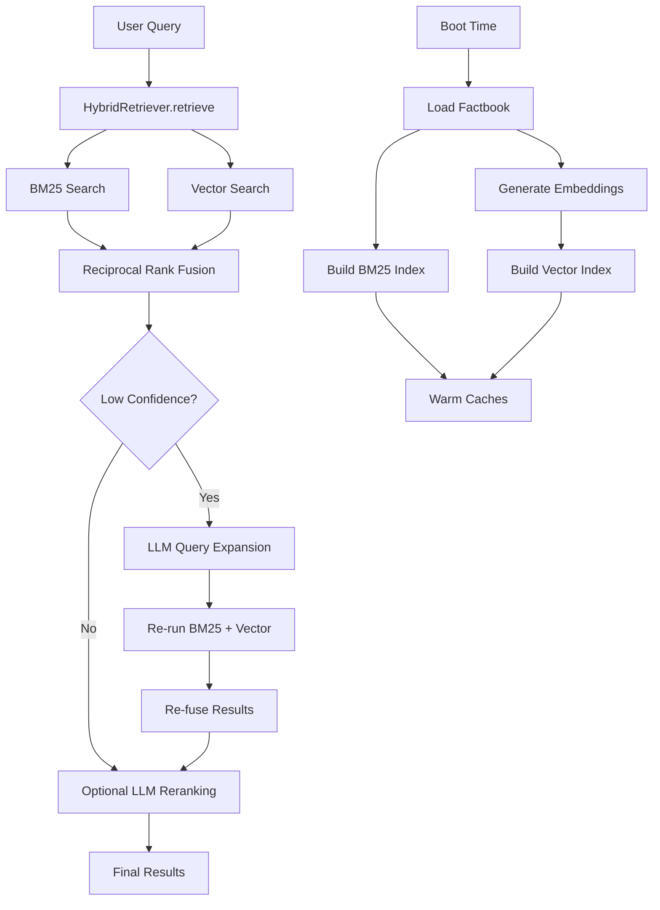
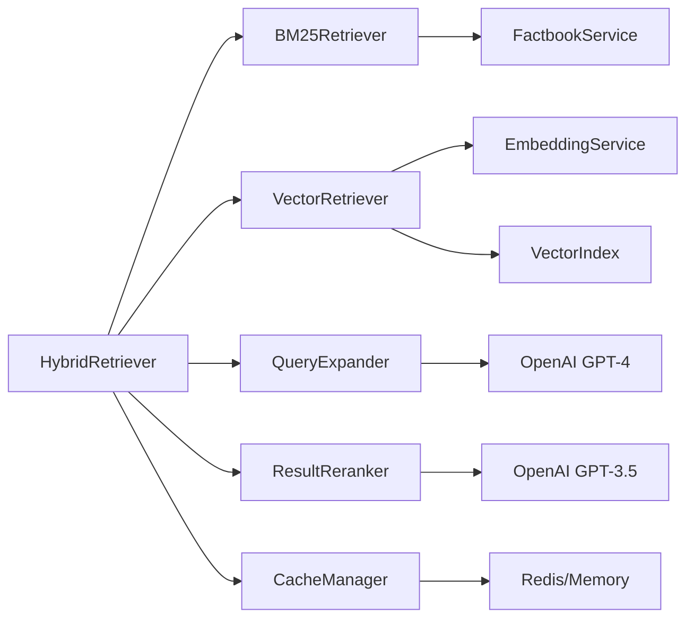

# Design Document

## Overview

The hybrid retrieval and smart expansion system enhances the existing jonathan-demo factbook architecture with semantic understanding capabilities. The system combines exact term matching (BM25) with semantic vector search, uses LLM-powered query expansion for low-confidence results, and optionally applies LLM reranking for optimal relevance. This enables natural concept connections like "snake story" → Morocco "cobra" memory while preserving the existing factbook schema, maintaining sub-300ms fast lane performance, and keeping Jonathan's authentic voice intact.

## Architecture

### High-Level System Flow



### Component Architecture



## Components and Interfaces

### Core Hybrid Retrieval Interface

```typescript
interface HybridRetrievalConfig {
  enableEmbeddings: boolean;
  enableExpansion: 'auto' | 'off';
  enableReranking: boolean;
  expansionThreshold: number; // Default: 0.3
  maxResults: number; // Default: 10
  fusionK: number; // Default: 60 for RRF
  timeoutMs: number; // Default: 500
}

interface RetrievalResult {
  snippet: FactbookSnippet;
  score: number;
  source: 'bm25' | 'vector' | 'expanded';
  confidence: number;
}

interface RetrievalMetrics {
  totalTimeMs: number;
  bm25TimeMs: number;
  vectorTimeMs: number;
  expansionTimeMs?: number;
  rerankTimeMs?: number;
  cacheHit: boolean;
  methodsUsed: string[];
  resultCount: number;
}

class HybridRetriever {
  constructor(config: HybridRetrievalConfig);
  
  async retrieve(query: string): Promise<{
    results: RetrievalResult[];
    metrics: RetrievalMetrics;
  }>;
  
  async warmup(): Promise<void>;
  getHealthStatus(): HealthStatus;
}
```

### BM25 Retrieval Component

```typescript
interface BM25Config {
  k1: number; // Default: 1.2
  b: number;  // Default: 0.75
  maxResults: number; // Default: 20
}

class BM25Retriever {
  private factbookService: FactbookService;
  private index: BM25Index;
  
  constructor(factbookService: FactbookService, config: BM25Config);
  
  async buildIndex(): Promise<void>;
  search(query: string, maxResults: number): BM25Result[];
  
  private calculateBM25Score(
    term: string, 
    document: FactbookSnippet, 
    corpus: FactbookSnippet[]
  ): number;
}

interface BM25Result {
  snippet: FactbookSnippet;
  score: number;
  termMatches: string[];
}

interface BM25Index {
  termFreq: Map<string, Map<string, number>>; // term -> docId -> frequency
  docFreq: Map<string, number>; // term -> document frequency
  docLengths: Map<string, number>; // docId -> document length
  avgDocLength: number;
  totalDocs: number;
}
```

### Vector Search Component

```typescript
interface VectorConfig {
  model: 'text-embedding-3-small' | 'text-embedding-3-large';
  dimensions: number; // 1536 for small, 3072 for large
  maxResults: number; // Default: 20
  similarityThreshold: number; // Default: 0.3
}

interface EmbeddingCache {
  get(text: string): Promise<number[] | null>;
  set(text: string, embedding: number[]): Promise<void>;
  clear(): Promise<void>;
}

class VectorRetriever {
  private embeddingService: EmbeddingService;
  private vectorIndex: VectorIndex;
  private cache: EmbeddingCache;
  
  constructor(config: VectorConfig);
  
  async buildIndex(snippets: FactbookSnippet[]): Promise<void>;
  async search(query: string, maxResults: number): Promise<VectorResult[]>;
  
  private async getQueryEmbedding(query: string): Promise<number[]>;
  private cosineSimilarity(a: number[], b: number[]): number;
}

interface VectorResult {
  snippet: FactbookSnippet;
  similarity: number;
  embedding: number[];
}

// Lightweight HNSW implementation for fast ANN search
interface VectorIndex {
  add(id: string, vector: number[]): void;
  search(query: number[], k: number): { id: string; distance: number }[];
  size(): number;
}
```

### Query Expansion Component

```typescript
interface ExpansionRequest {
  originalQuery: string;
  lowConfidenceResults: RetrievalResult[];
  context?: string;
}

interface ExpansionResponse {
  canonical_query: string;
  alternates: string[]; // ≤10 terms
  related_concepts: string[]; // ≤10 concepts
  confidence: number;
}

class QueryExpander {
  private openai: OpenAI;
  private cache: Map<string, ExpansionResponse>;
  
  constructor(apiKey: string);
  
  async expandQuery(request: ExpansionRequest): Promise<ExpansionResponse>;
  
  private buildExpansionPrompt(query: string): string;
  private validateExpansion(response: any): boolean;
  private getCacheKey(query: string): string;
}

// Expansion prompt template
const EXPANSION_PROMPT = `
You are a query expansion expert. Given a user query that returned few relevant results, 
generate semantically related terms that might help find relevant information.

Rules:
- Return JSON with canonical_query, alternates (≤10), related_concepts (≤10)
- Keep terms noun-heavy, lowercase, and tightly focused
- Do not paraphrase answers or create content
- Focus on synonyms, related terms, and concept variations

Query: "{query}"

Response format:
{
  "canonical_query": "cleaned version of original query",
  "alternates": ["synonym1", "synonym2", ...],
  "related_concepts": ["concept1", "concept2", ...]
}
`;
```

### Result Fusion Component

```typescript
interface FusionConfig {
  method: 'reciprocal_rank' | 'weighted_sum' | 'borda_count';
  k: number; // RRF parameter, default 60
  bm25Weight: number; // Default: 0.6
  vectorWeight: number; // Default: 0.4
}

class ResultFuser {
  constructor(config: FusionConfig);
  
  fuse(
    bm25Results: BM25Result[],
    vectorResults: VectorResult[]
  ): RetrievalResult[];
  
  private reciprocalRankFusion(
    results1: any[],
    results2: any[],
    k: number
  ): RetrievalResult[];
  
  private normalizeScores(results: any[]): any[];
}

// Reciprocal Rank Fusion implementation
// RRF(d) = Σ(1 / (k + rank_i(d))) for all ranking systems i
```

### LLM Reranking Component

```typescript
interface RerankRequest {
  query: string;
  candidates: RetrievalResult[];
  maxResults: number;
}

interface RerankResponse {
  id: string;
  relevanceScore: number; // 0-1
}

class ResultReranker {
  private openai: OpenAI;
  
  constructor(apiKey: string);
  
  async rerank(request: RerankRequest): Promise<RetrievalResult[]>;
  
  private buildRerankPrompt(query: string, candidates: RetrievalResult[]): string;
  private parseRerankResponse(response: string): RerankResponse[];
}

// Reranking prompt template
const RERANK_PROMPT = `
Rate the relevance of each text snippet to the query on a scale of 0-1.
Return only JSON with id and relevanceScore for each snippet.

Query: "{query}"

Snippets:
{snippets}

Response format:
[
  {"id": "snippet1", "relevanceScore": 0.85},
  {"id": "snippet2", "relevanceScore": 0.72}
]
`;
```

## Data Models

### Enhanced Factbook Integration

The hybrid system preserves the existing factbook schema while adding semantic capabilities:

```typescript
// Existing schema remains unchanged
interface FactbookSnippet {
  id: string;
  path: string;
  text: string;
  topics: string[];
  keywords: string[];
}

// New semantic metadata (stored separately)
interface SemanticMetadata {
  snippetId: string;
  embedding: number[];
  semanticKeywords: string[]; // LLM-extracted concepts
  lastUpdated: number;
}

// Combined for internal use
interface EnhancedSnippet extends FactbookSnippet {
  embedding?: number[];
  semanticScore?: number;
  retrievalSource?: 'bm25' | 'vector' | 'expanded';
}
```

### Embedding Storage Strategy

```typescript
interface EmbeddingStore {
  // File-based storage for persistence
  saveEmbeddings(embeddings: Map<string, number[]>): Promise<void>;
  loadEmbeddings(): Promise<Map<string, number[]>>;
  
  // Version tracking for cache invalidation
  getVersion(): string;
  setVersion(version: string): Promise<void>;
}

// Storage format: JSON with compression
interface EmbeddingFile {
  version: string;
  model: string;
  dimensions: number;
  embeddings: {
    [snippetId: string]: number[];
  };
  metadata: {
    createdAt: number;
    snippetCount: number;
    totalSize: number;
  };
}
```

## Error Handling

### Graceful Degradation Strategy

```typescript
interface FallbackChain {
  primary: () => Promise<RetrievalResult[]>;
  secondary: () => Promise<RetrievalResult[]>;
  tertiary: () => Promise<RetrievalResult[]>;
}

class RetrievalFallbackManager {
  async executeWithFallback(
    query: string,
    config: HybridRetrievalConfig
  ): Promise<RetrievalResult[]> {
    const fallbacks: FallbackChain = {
      // Full hybrid with expansion and reranking
      primary: () => this.fullHybridRetrieval(query, config),
      
      // Hybrid without expansion/reranking
      secondary: () => this.basicHybridRetrieval(query, config),
      
      // BM25 only (existing system)
      tertiary: () => this.bm25OnlyRetrieval(query)
    };
    
    for (const [level, fallback] of Object.entries(fallbacks)) {
      try {
        const results = await this.withTimeout(fallback(), config.timeoutMs);
        console.log(`retrieval_success`, { level, resultCount: results.length });
        return results;
      } catch (error) {
        console.warn(`retrieval_fallback`, { level, error: error.message });
      }
    }
    
    // Final fallback: empty results with error logging
    console.error('retrieval_total_failure', { query });
    return [];
  }
  
  private async withTimeout<T>(
    promise: Promise<T>, 
    timeoutMs: number
  ): Promise<T> {
    return Promise.race([
      promise,
      new Promise<never>((_, reject) => 
        setTimeout(() => reject(new Error('Timeout')), timeoutMs)
      )
    ]);
  }
}
```

### Error Response Templates

```typescript
const ERROR_RESPONSES = {
  VECTOR_SEARCH_FAILED: "Semantic search temporarily unavailable, using keyword matching",
  EXPANSION_TIMEOUT: "Query expansion timed out, using original results",
  RERANK_FAILED: "Result reranking failed, using fusion scores",
  EMBEDDING_GENERATION_FAILED: "Could not generate embeddings, falling back to text search",
  CACHE_UNAVAILABLE: "Cache temporarily unavailable, performance may be slower"
};

interface ErrorContext {
  component: string;
  operation: string;
  query: string;
  error: Error;
  fallbackUsed: boolean;
}
```

## Testing Strategy

### Unit Tests

```typescript
describe('HybridRetriever', () => {
  describe('BM25 Component', () => {
    it('should calculate correct BM25 scores');
    it('should handle empty queries gracefully');
    it('should respect max results limit');
  });
  
  describe('Vector Search', () => {
    it('should generate consistent embeddings');
    it('should find semantically similar content');
    it('should handle embedding cache misses');
  });
  
  describe('Query Expansion', () => {
    it('should expand "snake story" to include "cobra", "serpent"');
    it('should limit alternates to ≤10 terms');
    it('should timeout gracefully on slow LLM calls');
  });
  
  describe('Result Fusion', () => {
    it('should implement reciprocal rank fusion correctly');
    it('should handle empty result sets');
    it('should preserve snippet metadata');
  });
});
```

### Integration Tests

```typescript
describe('Semantic Connection Tests', () => {
  const testCases = [
    {
      query: "snake story",
      expectedSnippets: ["morocco_cobra_encounter"],
      description: "Should connect snake → cobra semantically"
    },
    {
      query: "meetings at SXSW", 
      expectedSnippets: ["bill_murray_encounter", "gza_concert"],
      description: "Should find SXSW-related memories"
    },
    {
      query: "Tyler partner",
      expectedSnippets: ["tyler_cansu_relationship"],
      description: "Should connect Tyler → Cansu relationship"
    }
  ];
  
  testCases.forEach(({ query, expectedSnippets, description }) => {
    it(description, async () => {
      const results = await hybridRetriever.retrieve(query);
      const snippetIds = results.results.map(r => r.snippet.id);
      
      expectedSnippets.forEach(expectedId => {
        expect(snippetIds).toContain(expectedId);
      });
    });
  });
});
```

### Performance Tests

```typescript
describe('Performance Requirements', () => {
  it('should maintain p95 latency ≤600ms with all features enabled', async () => {
    const latencies: number[] = [];
    
    for (let i = 0; i < 100; i++) {
      const start = Date.now();
      await hybridRetriever.retrieve("test query");
      latencies.push(Date.now() - start);
    }
    
    const p95 = latencies.sort()[Math.floor(latencies.length * 0.95)];
    expect(p95).toBeLessThanOrEqual(600);
  });
  
  it('should cache embeddings effectively', async () => {
    const query = "repeated test query";
    
    // First call - cache miss
    const start1 = Date.now();
    await hybridRetriever.retrieve(query);
    const time1 = Date.now() - start1;
    
    // Second call - cache hit
    const start2 = Date.now();
    await hybridRetriever.retrieve(query);
    const time2 = Date.now() - start2;
    
    expect(time2).toBeLessThan(time1 * 0.5); // 50% faster with cache
  });
});
```

## Implementation Phases

### Phase 1: Core Infrastructure (High Priority)
- Implement BM25Retriever with existing FactbookService integration
- Create VectorRetriever with OpenAI embeddings
- Build ResultFuser with Reciprocal Rank Fusion
- Add comprehensive feature flags and configuration
- Implement basic caching for embeddings

### Phase 2: Smart Expansion (Medium Priority)  
- Implement QueryExpander with GPT-4 integration
- Add low-confidence detection logic
- Create expansion caching system
- Build timeout and fallback mechanisms
- Add expansion metrics and logging

### Phase 3: LLM Reranking (Medium Priority)
- Implement ResultReranker with GPT-3.5-turbo
- Add reranking prompt optimization
- Create reranking cache system
- Build performance monitoring
- Add A/B testing capabilities

### Phase 4: Performance Optimization (Medium Priority)
- Implement lightweight HNSW vector index
- Add Redis caching support
- Optimize embedding generation pipeline
- Build comprehensive monitoring dashboard
- Add memory usage optimization

### Phase 5: Testing and Validation (High Priority)
- Create comprehensive test suite with golden outputs
- Implement performance regression tests
- Add semantic connection validation
- Build monitoring and alerting
- Create deployment validation scripts

## Monitoring and Observability

### Metrics Collection

```typescript
interface HybridRetrievalMetrics {
  // Performance metrics
  totalLatencyMs: number;
  bm25LatencyMs: number;
  vectorLatencyMs: number;
  expansionLatencyMs?: number;
  rerankLatencyMs?: number;
  
  // Quality metrics
  resultCount: number;
  confidenceScore: number;
  cacheHitRate: number;
  
  // Usage metrics
  methodsUsed: string[];
  expansionTriggered: boolean;
  rerankingApplied: boolean;
  fallbackUsed: boolean;
  
  // Error tracking
  errors: string[];
  warnings: string[];
}

class MetricsCollector {
  private metrics: HybridRetrievalMetrics[] = [];
  
  recordRetrieval(metrics: HybridRetrievalMetrics): void;
  getAggregatedMetrics(timeWindowMs: number): AggregatedMetrics;
  exportPrometheusMetrics(): string;
}
```

### Dashboard Integration

```typescript
interface DashboardData {
  // Real-time performance
  currentP95Latency: number;
  currentThroughput: number;
  errorRate: number;
  
  // Feature usage
  hybridUsagePercent: number;
  expansionTriggerRate: number;
  rerankingUsagePercent: number;
  
  // Quality indicators
  averageResultCount: number;
  averageConfidenceScore: number;
  cacheEfficiency: number;
  
  // System health
  embeddingCacheSize: number;
  vectorIndexSize: number;
  memoryUsageMB: number;
}
```

This design ensures the hybrid retrieval system meets all requirements while maintaining the existing factbook architecture, providing intelligent semantic search capabilities, and preserving Jonathan's authentic conversational experience.