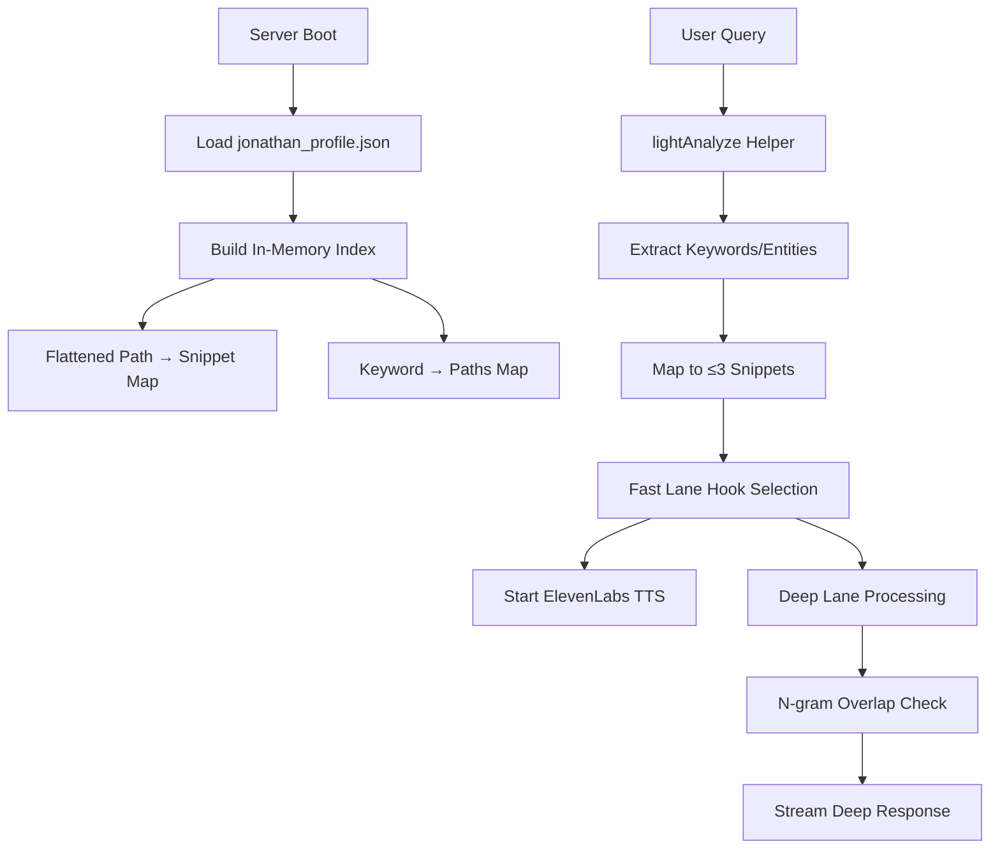

# Design Document

## Overview

The jonathan-demo factbook architecture replaces the current database-driven memory pipeline with a clean, Apple-like system that loads a canonical JSON factbook at server boot and uses lightweight in-memory indexing for instant responses. The system prioritizes speed (<300ms fast lane, ~1s deep lane), accuracy (factbook-only responses), and crispness (coordinated fast/deep lanes with no repetition).

## Architecture

### High-Level Flow



### Core Components

1. **FactbookService**: Manages factbook loading and indexing
2. **LightweightAnalyzer**: Extracts keywords and maps to snippets  
3. **FastHookSelector**: Selects 1-2 sentence hooks (≤160 chars)
4. **DeepLaneCoordinator**: Builds on hooks with factbook details
5. **RepetitionGuard**: Prevents n-gram overlap (≤30%)

## Components and Interfaces

### FactbookService

```typescript
interface FactbookSnippet {
  id: string;
  path: string; // e.g., "pets.olive.description"
  text: string; // ≤400 chars
  topics: string[]; // ["pets", "dogs", "maine"]
  keywords: string[]; // ["olive", "puerto", "rican", "street", "dog"]
}

interface FactbookIndex {
  snippets: Map<string, FactbookSnippet>; // path → snippet
  keywordMap: Map<string, string[]>; // keyword → snippet paths
  topicFences: Map<string, Set<string>>; // topic → allowed paths
}

class FactbookService {
  private static instance: FactbookService;
  private index: FactbookIndex | null = null;
  
  static getInstance(): FactbookService;
  async loadFactbook(filePath: string): Promise<void>;
  buildIndex(factbook: any): FactbookIndex;
  querySnippets(keywords: string[], maxResults: number): FactbookSnippet[];
  getSnippetsByTopic(topic: string): FactbookSnippet[];
}
```

### Enhanced jonathan_profile.json Structure

```json
{
  "identity": {
    "full_name": "Jonathan Braden",
    "nickname": "Jon, JB, Braden", 
    "birthday": "1980-03-15",
    "current_location": "Sofia, Bulgaria"
  },
  "timeline": {
    "austin_years": {
      "period": "2009-2018",
      "description": "Lived in Austin, Texas for 9 incredible years. The music scene was amazing, the food was fantastic, and I made lifelong friends.",
      "highlights": [
        "Discovered amazing BBQ joints all over the city",
        "Went to South by Southwest every year", 
        "Made great friends in the tech community"
      ]
    }
  },
  "relationships": {
    "tyler": {
      "type": "friend",
      "location": "Austin",
      "description": "One of my closest friends from Austin. Tyler is incredibly smart, has a great sense of humor, and we bonded over our shared love of technology and good food.",
      "memories": [
        "We used to explore different BBQ places every weekend",
        "Tyler introduced me to some of the best breakfast tacos in Austin"
      ]
    }
  },
  "pets": {
    "olive": {
      "type": "dog", 
      "breed": "Puerto Rican street dog",
      "description": "Olive was my beloved Puerto Rican street dog who came with me to Maine. She was tough as nails but sweet as pie.",
      "story": "Found her as a stray in Puerto Rico. She survived a brutal Maine winter and became the toughest, most loyal companion. When she passed, we buried her in Texas.",
      "topics": ["pets", "dogs", "maine", "puerto_rico", "texas"]
    },
    "romeo": {
      "type": "dog",
      "description": "My current dog Romeo. He's energetic, playful, and always getting into mischief.",
      "topics": ["pets", "dogs", "current"]
    }
  },
  "opinions": {
    "trump": {
      "stance": "strongly_opposed",
      "description": "I think Trump is absolutely terrible for America. His policies on immigration are cruel and his rhetoric is divisive.",
      "topics": ["politics", "trump", "immigration"]
    }
  }
}
```

### LightweightAnalyzer

```typescript
interface QueryAnalysis {
  keywords: string[];
  entities: string[];
  topics: string[];
  intent: 'factual' | 'opinion' | 'story' | 'general';
}

class LightweightAnalyzer {
  analyzeQuery(query: string): QueryAnalysis;
  extractKeywords(text: string): string[];
  detectEntities(text: string): string[];
  classifyTopics(keywords: string[], entities: string[]): string[];
  applyTopicFences(topics: string[]): string[]; // Prevent cross-contamination
}
```

### FastHookSelector (Enhanced)

```typescript
interface FactbookHookSelection {
  hook: string; // ≤160 chars
  snippetIds: string[];
  coordinationHints: {
    expandOn: string[]; // Snippet IDs to expand
    avoidRepeating: string[]; // Key phrases to avoid
    suggestedTone: string;
    topicFocus: string;
  };
}

class FastHookSelector {
  selectHook(snippets: FactbookSnippet[], query: string): FactbookHookSelection;
  generateHookFromSnippet(snippet: FactbookSnippet): string;
  createCoordinationHints(selectedSnippets: FactbookSnippet[], hook: string): any;
}
```

## Data Models

### Factbook Structure Design

The factbook uses a hierarchical structure with clear topic boundaries:

- **identity/**: Basic biographical facts
- **timeline/**: Time-based experiences and periods  
- **relationships/**: People and their descriptions
- **pets/**: Pet stories and descriptions
- **opinions/**: Political and personal stances
- **places/**: Locations and experiences
- **interests/**: Hobbies and passions

Each section contains snippets with:
- **text**: The actual content (≤400 chars)
- **topics**: Topic tags for fencing
- **keywords**: Searchable terms
- **metadata**: Type, relevance scores, etc.

### Topic Fencing Rules

```typescript
const TOPIC_FENCES = {
  'pets': ['pets', 'dogs', 'animals'],
  'politics': ['politics', 'trump', 'immigration', 'america'],
  'places': ['austin', 'texas', 'maine', 'sofia', 'bulgaria'],
  'people': ['tyler', 'krissy', 'friends', 'family'],
  'timeline': ['austin_years', 'maine_period', 'current_life']
};
```

When user asks about "Olive", only snippets tagged with 'pets' topics are considered, preventing political content from bleeding in.

## Error Handling

### Graceful Degradation Strategy

1. **Corrupt Factbook**: Validate JSON structure at boot, fail fast with clear error
2. **Missing Snippets**: Return "I don't have information about that" rather than hallucinate
3. **Index Corruption**: Rebuild index from factbook, log warning
4. **Query Processing Failure**: Fall back to simple keyword matching
5. **ElevenLabs Failure**: Continue with text-only response, log error

### Error Response Templates

```typescript
const ERROR_RESPONSES = {
  NO_FACTBOOK_DATA: "I don't have specific information about that in my memory.",
  FACTBOOK_CORRUPTED: "There's an issue with my memory system. Please try again.",
  QUERY_TOO_COMPLEX: "Could you ask that in a simpler way?",
  TOPIC_FENCE_VIOLATION: "That's outside my area of knowledge."
};
```

## Testing Strategy

### Unit Tests

1. **FactbookService Tests**
   - JSON loading and validation
   - Index building performance (O(n) constraint)
   - Snippet retrieval accuracy

2. **LightweightAnalyzer Tests**  
   - Keyword extraction accuracy
   - Topic classification correctness
   - Topic fence enforcement

3. **FastHookSelector Tests**
   - Hook quality and length constraints
   - Coordination hint generation
   - Fallback behavior

### Integration Tests

1. **End-to-End Query Tests**
   - "Tell me about Olive" → Puerto Rican street dog facts, no politics
   - "When did you live in Austin" → 2009-2018, no drift
   - "Tell me about Tyler" → Austin friend traits, no unrelated details

2. **Performance Tests**
   - Fast lane response time <300ms
   - Deep lane completion <1s
   - Memory usage constraints

3. **Coordination Tests**
   - Fast/deep lane handoff smoothness
   - N-gram overlap prevention (≤30%)
   - Topic consistency across lanes

### Golden Output Tests

```typescript
const GOLDEN_TESTS = [
  {
    query: "Tell me about Olive",
    expectedHook: /Puerto Rican street dog|Maine winter|tough as nails/,
    forbiddenContent: /trump|politics|immigration/,
    expectedTopics: ["pets", "dogs"]
  },
  {
    query: "When did you live in Austin", 
    expectedHook: /2009.*2018|nine years|incredible chapter/,
    forbiddenContent: /unrelated|other cities/,
    expectedTopics: ["places", "timeline"]
  }
];
```

### Performance Monitoring

```typescript
interface PerformanceMetrics {
  t_hook_ms: number; // Fast lane response time
  t_deep_first_token_ms: number; // Deep lane start time  
  t_deep_done_ms: number; // Deep lane completion
  snippets_selected: string[]; // Which snippets were used
  keyword_extraction_ms: number; // Analysis time
  index_query_ms: number; // Index lookup time
}
```

## Implementation Phases

### Phase 1: Core Factbook System
- Implement FactbookService with JSON loading
- Build in-memory indexing (flattened paths + keywords)
- Create LightweightAnalyzer for O(m) query processing
- Add basic error handling and validation

### Phase 2: Fast Lane Integration  
- Enhance FastHookSelector for factbook snippets
- Implement topic fencing to prevent cross-contamination
- Add performance monitoring and logging
- Create fallback responses for missing data

### Phase 3: Deep Lane Coordination
- Implement DeepLaneCoordinator with factbook-only responses
- Add n-gram overlap checking (≤30% threshold)
- Integrate with existing ElevenLabs streaming
- Add coordination hints and handoff logic

### Phase 4: Testing and Optimization
- Implement comprehensive test suite with golden outputs
- Add CI performance gates (300ms/1s thresholds)
- Optimize index structure for memory efficiency
- Add monitoring dashboard for factbook health

This design ensures the system meets all Apple-like quality requirements: instant responses, zero hallucination, crisp coordination, and bulletproof reliability.