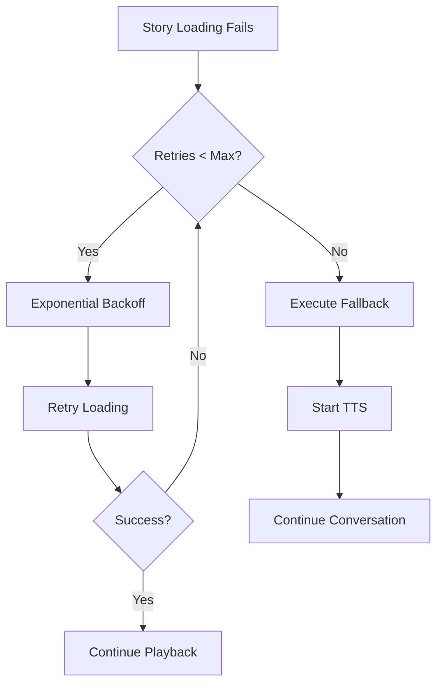
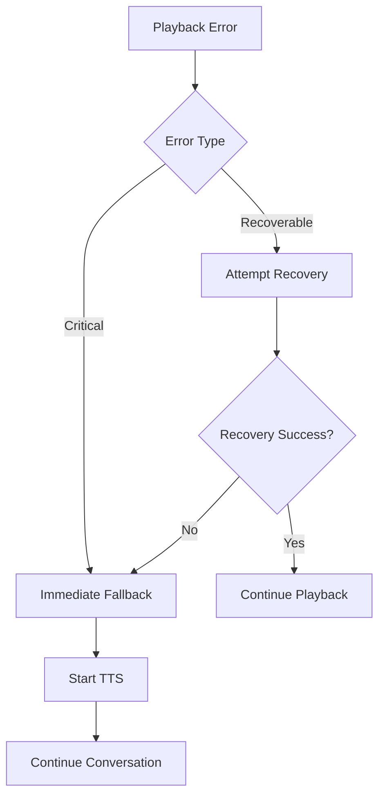
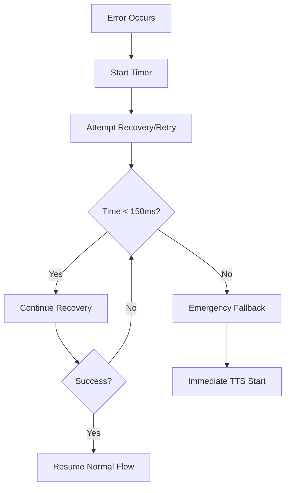

# StoryErrorHandler - Comprehensive Error Handling System

## Overview

The `StoryErrorHandler` provides comprehensive error handling and fallback mechanisms for the authentic voice stories system. It ensures graceful degradation when stories fail to load or play, with automatic TTS fallback and seamless conversation continuation.

## Key Features

### 🔄 Graceful Fallback
- Automatic TTS fallback when story loading/playback fails
- Maintains conversation flow with no gap >150ms
- Seamless transition between story audio and TTS

### ⚡ Performance Constraints
- Enforces 150ms maximum gap constraint
- Retry logic with exponential backoff
- Emergency fallback for critical failures

### 🛡️ Error Classification
- Categorizes errors by type and recoverability
- Different handling strategies for different error types
- Comprehensive logging and metrics tracking

### 📊 Monitoring & Metrics
- Tracks error rates by type and story
- Performance metrics for fallback timing
- Resource usage monitoring

## Error Types

### Recoverable Errors
- `NETWORK_TIMEOUT` - Network request timeouts
- `STORAGE_UNAVAILABLE` - Temporary storage service issues
- `CONCURRENT_PLAYBACK_ERROR` - Audio conflicts

### Non-Recoverable Errors
- `AUDIO_CONTEXT_ERROR` - AudioContext suspension/failure
- `MEMORY_LIMIT_EXCEEDED` - Device memory constraints
- `AUDIO_DECODE_ERROR` - Audio format/corruption issues
- `PLAYBACK_FAILED` - General playback failures

## Usage

### Basic Error Handling

```typescript
import { storyErrorHandler } from './storyErrorHandler';

// Handle story loading errors
await storyErrorHandler.handleLoadingError(
  storyId,
  error,
  fallbackText,
  fallbackCallback
);

// Handle playback errors
await storyErrorHandler.handlePlaybackError(
  storyId,
  error,
  fallbackText,
  fallbackCallback
);

// Handle trigger matching errors
await storyErrorHandler.handleTriggerMatchingError(
  error,
  fallbackText,
  fallbackCallback
);
```

### Custom Configuration

```typescript
import { StoryErrorHandler } from './storyErrorHandler';

const customErrorHandler = new StoryErrorHandler({
  maxRetries: 3,
  retryDelayMs: 1000,
  fallbackTimeoutMs: 200,
  enableFallbackTTS: true,
  logErrors: true,
  maxGapMs: 200
});
```

### Fallback Callback Registration

```typescript
// Register fallback callback for specific story
storyErrorHandler.registerFallbackCallback(storyId, async () => {
  await streamingManager.addSentence(fallbackText);
});
```

## Integration with Story System

### StoryAudioManager Integration

The `StoryAudioManager` automatically integrates with the error handler:

```typescript
// Error handler is initialized in constructor
this.errorHandler = new StoryErrorHandler({
  maxRetries: 2,
  retryDelayMs: 500,
  fallbackTimeoutMs: 150,
  enableFallbackTTS: this.config.fallbackToTTS,
  logErrors: true,
  maxGapMs: 150
});

// Used during story playback
const fallbackCallback = async () => {
  await streamingManager.addSentence(fallbackText);
};

this.errorHandler.registerFallbackCallback(story.id, fallbackCallback);
```

### StoryTriggerMatcher Integration

The `StoryTriggerMatcher` uses error handling for trigger matching failures:

```typescript
// Handle trigger matching errors
await storyErrorHandler.handleTriggerMatchingError(
  error,
  'Story matching workflow error',
  fallbackCallback
);
```

## Error Handling Workflow

### 1. Loading Error Flow



### 2. Playback Error Flow



### 3. Timing Constraints



## Performance Requirements

### Timing Constraints
- **Maximum Gap**: 150ms between story failure and TTS start
- **Retry Timeout**: Individual retries must complete within timing budget
- **Emergency Fallback**: Immediate TTS start when timing exceeded

### Resource Management
- **Memory Cleanup**: Automatic cleanup of retry attempts and callbacks
- **Error Tracking**: Bounded error statistics to prevent memory leaks
- **Concurrent Handling**: Efficient handling of multiple simultaneous errors

## Monitoring & Metrics

### Error Metrics
- `story_error_{type}` - Count of errors by type
- `story_error_by_story` - Errors per story ID
- `story_fallback_success` - Successful fallbacks
- `story_emergency_fallback` - Emergency fallbacks triggered
- `story_critical_failure` - Critical system failures

### Performance Metrics
- `story_fallback_duration_ms` - Time to execute fallback
- `story_trigger_matching_failed` - Trigger matching failures

### Usage Example

```typescript
// Get error statistics
const stats = storyErrorHandler.getErrorStats();
console.log(`Active retries: ${stats.activeRetries}`);
console.log(`Registered callbacks: ${stats.registeredCallbacks}`);

// Monitor error rates
metrics.increment('story_error_network_timeout');
metrics.timing('story_fallback_duration_ms', duration);
```

## Testing

### Unit Tests
- Error classification and recovery logic
- Timing constraint enforcement
- Resource management and cleanup
- Fallback callback execution

### Integration Tests
- End-to-end error scenarios
- Real-world failure conditions
- Performance under load
- Mobile device compatibility

### Test Examples

```typescript
// Test error handling
it('should handle network failures gracefully', async () => {
  const error = new Error('Network timeout');
  const callback = vi.fn().mockResolvedValue(undefined);
  
  await errorHandler.handleLoadingError(
    'test-story',
    error,
    'Fallback text',
    callback
  );
  
  expect(callback).toHaveBeenCalled();
});

// Test timing constraints
it('should enforce 150ms maximum gap', async () => {
  const startTime = Date.now();
  await errorHandler.handleLoadingError(/* ... */);
  const elapsed = Date.now() - startTime;
  
  expect(elapsed).toBeLessThan(200);
});
```

## Best Practices

### Error Handling
1. **Always provide fallback callbacks** for graceful degradation
2. **Use appropriate error types** for proper classification
3. **Register callbacks early** to ensure they're available when needed
4. **Clean up resources** after error handling completes

### Performance
1. **Keep fallback callbacks lightweight** to meet timing constraints
2. **Avoid blocking operations** in error handling paths
3. **Use exponential backoff** for retries to prevent system overload
4. **Monitor error rates** to identify systemic issues

### Debugging
1. **Enable logging** in development environments
2. **Track error metrics** for production monitoring
3. **Use structured error context** for better debugging
4. **Test error scenarios** thoroughly before deployment

## Configuration Options

### ErrorRecoveryConfig

```typescript
interface ErrorRecoveryConfig {
  maxRetries: number;        // Maximum retry attempts (default: 2)
  retryDelayMs: number;      // Base retry delay (default: 500ms)
  fallbackTimeoutMs: number; // Fallback timeout (default: 150ms)
  enableFallbackTTS: boolean; // Enable TTS fallback (default: true)
  logErrors: boolean;        // Enable error logging (default: true)
  maxGapMs: number;         // Maximum gap constraint (default: 150ms)
}
```

### Environment-Specific Configurations

```typescript
// Development
const devConfig = {
  maxRetries: 1,
  retryDelayMs: 100,
  logErrors: true
};

// Production
const prodConfig = {
  maxRetries: 3,
  retryDelayMs: 1000,
  logErrors: false
};

// Mobile
const mobileConfig = {
  maxRetries: 2,
  fallbackTimeoutMs: 100, // Stricter timing for mobile
  maxGapMs: 100
};
```

## Troubleshooting

### Common Issues

1. **High Error Rates**
   - Check network connectivity
   - Verify audio file integrity
   - Monitor system resource usage

2. **Timing Constraint Violations**
   - Reduce retry delays
   - Optimize fallback callbacks
   - Check system performance

3. **Memory Leaks**
   - Ensure proper cleanup calls
   - Monitor error statistics growth
   - Check callback registration patterns

### Debug Commands

```typescript
// Get current error statistics
console.log(storyErrorHandler.getErrorStats());

// Clear all resources for testing
storyErrorHandler.cleanup();

// Check error classification
const errorType = storyErrorHandler['classifyPlaybackError'](error);
console.log(`Error type: ${errorType}`);
```

## Future Enhancements

### Planned Features
- **Adaptive retry strategies** based on error patterns
- **Circuit breaker pattern** for failing services
- **Error prediction** using machine learning
- **Advanced metrics** with percentile tracking

### Extensibility
- **Custom error types** for specific use cases
- **Pluggable recovery strategies** for different scenarios
- **External monitoring integration** (Sentry, DataDog, etc.)
- **A/B testing** for error handling strategies